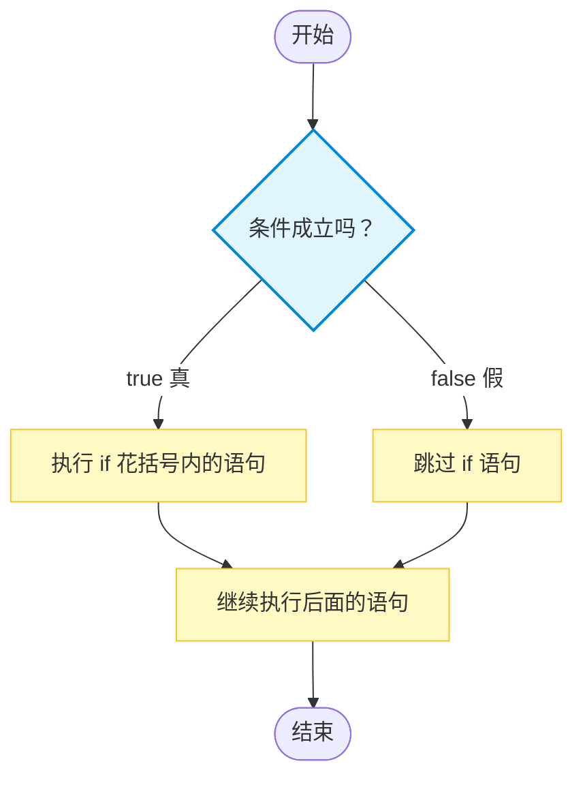
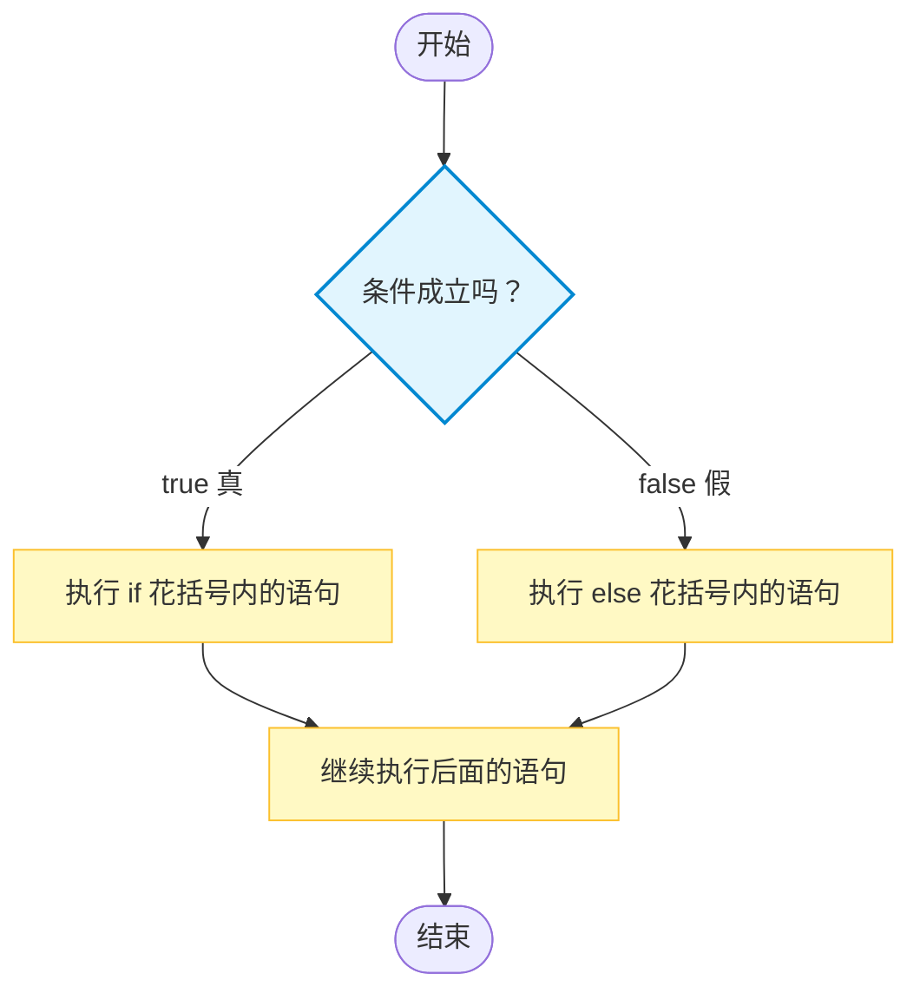
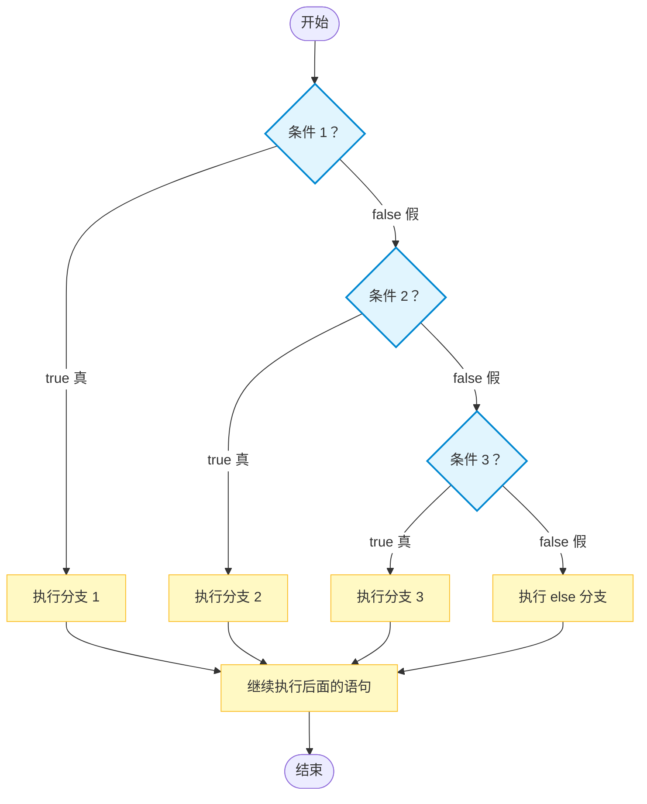

# C1-03 分支语句与比较运算符

比较运算符、`if` 语句与条件判断

> 学习目标：理解程序为什么需要“根据情况做选择”；掌握 `<`、`<=`、`>`、`>=`、`==`、`!=` 六个比较运算符；学会使用 `if`、`if-else` 和 `if-else if-else`；理解三目运算符的基本写法；能够完成“输入数据 → 判断条件 → 输出结果”的简单分支程序。

## 一、为什么需要分支

### 1\. 第二课的程序有什么特点

第二课中的程序通常是一条路走到底：

```cpp
int a, b;
cin >> a >> b;
cout << a + b << endl;
```

程序会按照从上到下的顺序执行每一条语句。这种结构叫作**顺序结构**。

### 2\. 现实问题需要“看情况”

很多问题不能只做同一种处理，而是要先判断情况：

-   成绩大于等于 60 分，输出“及格”；否则输出“不及格”。
-   一个数大于 0，是正数；小于 0，是负数；等于 0，是零。
-   一个数除以 2 的余数是 0，是偶数；否则是奇数。
-   两个数中，输出较大的那个。

这些问题都需要程序根据条件选择不同的道路，这种结构叫作**分支结构**。

### 3\. 分支程序的基本流程

本课会经常遇到下面的流程：

```text
输入数据（Input） → 判断条件（Condition） → 选择分支（Branch） → 输出结果（Output）
```

例如，判断成绩是否及格：

```text
输入 score → 判断 score >= 60 → 输出“及格”或“不及格”
```

### 4\. 本课的学习范围

本课先学习一个条件的判断：

```cpp
score >= 60
n % 2 == 0
a > b
```

多个条件同时成立、至少一个条件成立，以及条件取反，需要使用逻辑运算符 `&&`、`||`、`!`，放在后面的课程学习。

## 二、比较运算符

### 1\. 比较运算符是什么

**比较运算符**用来比较两个值的大小，或者判断两个值是否相等。

比较的结果只有两种，这种结果叫作**布尔值**：

-   条件成立，结果是 `true`，表示“真”；
-   条件不成立，结果是 `false`，表示“假”。

在 C++ 中，`true` 通常可以看作 `1`，`false` 通常可以看作 `0`。

### 2\. 六个比较运算符

| 运算符 | 名称 | 含义 | 示例 | 示例结果 |
| --- | --- | --- | --- | --- |
| `<` | 小于运算符 | 左边小于右边 | `3 < 4` | `true` |
| `<=` | 小于等于运算符 | 左边小于或等于右边 | `4 <= 4` | `true` |
| `>` | 大于运算符 | 左边大于右边 | `3 > 4` | `false` |
| `>=` | 大于等于运算符 | 左边大于或等于右边 | `3 >= 4` | `false` |
| `==` | 等于运算符 | 判断两边是否相等 | `3 == 3` | `true` |
| `!=` | 不等于运算符 | 判断两边是否不相等 | `3 != 4` | `true` |

建议按照“大小关系在前，相等关系在后”的顺序记忆：

```text
小于：<
小于等于：<=
大于：>
大于等于：>=
等于：==
不等于：!=
```

在比较运算符内部，`<`、`<=`、`>`、`>=` 的优先级高于 `==`、`!=`。所以以后看到多个比较符号时，可以先计算大小关系，再计算相等关系。

### 3\. 比较结果可以直接输出

```cpp
cout << (3 < 4) << endl;      // 输出 1，表示 true
cout << (3 > 4) << endl;      // 输出 0，表示 false
cout << (5 == 5) << endl;     // 输出 1，表示 true
```

这里的括号是**必须的**。因为**输出运算符** `<<` 的优先级高于比较运算符，下面的写法：

```cpp
cout << 3 < 4;
```

会被 C++ 按照下面的顺序理解：

```cpp
(cout << 3) < 4;
```

程序会先执行输出，再拿输出流对象继续和 `4` 比较，通常会出现编译错误。正确写法必须把比较表达式括起来：

```cpp
cout << (3 < 4) << endl;
```

同理，输出 `==`、`!=`、`<=`、`>=` 的结果时，也必须加括号：

```cpp
cout << (5 == 5) << endl;
cout << (5 != 4) << endl;
cout << (5 <= 6) << endl;
cout << (5 >= 4) << endl;
```

### 4\. 最容易混淆的 `=` 和 `==`

| 符号 | 名称 | 作用 | 示例 |
| --- | --- | --- | --- |
| `=` | 赋值运算符 | 把右边的值放进左边的变量 | `a = 5;` |
| `==` | 等于运算符 | 判断两边是否相等 | `a == 5` |

```cpp
int a = 5;

a = 0;       // 把 0 放进 a，改变 a 的值
a == 0       // 判断 a 是否等于 0
```

> **重点记忆：** 一个等号 `=` 是“放进去”，两个等号 `==` 是“判断相等”。写判断条件时，判断相等一定使用两个等号。

### 5\. 比较运算符的常见用法

```cpp
score >= 60      // 成绩达到 60 分
age < 18         // 年龄小于 18
a > b            // a 大于 b
n % 2 == 0       // n 是偶数
n % 2 != 0       // n 是奇数
a != 0            // a 不等于 0
```

判断奇数时，推荐使用 `n % 2 != 0`。这样即使输入负数，也能表示“不能被 2 整除”。

## 三、比较表达式的计算顺序

### 1\. 先算算术，再做比较

算术运算符的**优先级**高于比较运算符。因此，下面的表达式会先计算 `a + b`，再判断它是否大于 `c`：

```cpp
int a = 3, b = 4, c = 5;

cout << (a + b > c) << endl;   // 先算 3+4，再判断 7>5，输出 1
cout << (a * b >= c) << endl;  // 先算 3*4，再判断 12>=5，输出 1
```

为了让代码更容易读懂，比较复杂时建议主动加括号：

```cpp
if ((a + b) > c) {
    cout << "a+b 更大" << endl;
}
```

### 2\. 比较运算符不能像数学那样连写

数学中可以写：

```text
a < b < c
```

但 C++ 中不能这样写：

```cpp
if (a < b < c) {       // 错误：逻辑通常不是你想要的
    cout << "a、b、c 递增" << endl;
}
```

C++ 会先计算 `a < b`，结果得到 `0` 或 `1`，然后再拿这个 `0` 或 `1` 与 `c` 比较，结果很容易出错。

本课阶段，如果需要分两次判断，可以先写成嵌套的 `if`：

```cpp
if (a < b) {
    if (b < c) {
        cout << "a < b 且 b < c" << endl;
    }
}
```

以后学习逻辑运算符 `&&` 后，可以把多个条件写在一起。

## 四、`if` 单分支语句

### 1\. 基本语法

```cpp
if (条件) {
    // 条件成立时执行的语句
}
```

这是一个**单分支语句**。执行过程：

1.  先计算括号里的条件；
2.  如果条件为真，执行花括号里的代码；
3.  如果条件为假，跳过花括号里的代码。

### 2\. `if` 的流程图



### 3\. 示例：判断正数

```cpp
int n;
cin >> n;

if (n > 0) {
    cout << "正数" << endl;
}
```

输入 `5`，输出：

```text
正数
```

输入 `-3`，条件 `n > 0` 不成立，程序不输出任何内容。

### 4\. 示例：达到目标才输出

```cpp
int score;
cin >> score;

if (score >= 60) {
    cout << "及格" << endl;
}
```

只有成绩大于等于 60 时，程序才输出“及格”。

### 5\. 花括号要不要写

如果 `if` 后面只有一条语句，花括号有时可以省略：

```cpp
if (n > 0)
    cout << "正数" << endl;
```

但是初学阶段建议**一律写花括号**。这样即使以后增加语句，也不容易出错：

```cpp
if (n > 0) {
    cout << "正数" << endl;
    cout << "这个数大于 0" << endl;
}
```

看下面的危险写法：

```cpp
if (n > 0)
    cout << "正数" << endl;
    cout << "判断结束" << endl;   // 这行不在 if 内，会一直执行
```

代码的缩进不会改变程序的真正结构，花括号才会。

## 五、`if-else` 双分支语句

### 1\. 基本语法

```cpp
if (条件) {
    // 条件成立时执行
} else {
    // 条件不成立时执行
}
```

执行过程是二选一：

-   条件为真，执行 `if` 分支；
-   条件为假，执行 `else` 分支；
-   两个分支只会执行一个。

### 2\. `if-else` 的流程图



### 3\. 示例：判断及格与不及格

```cpp
int score;
cin >> score;

if (score >= 60) {
    cout << "及格" << endl;
} else {
    cout << "不及格" << endl;
}
```

输入 `80`，输出：

```text
及格
```

输入 `50`，输出：

```text
不及格
```

### 4\. 示例：判断奇数和偶数

```cpp
int n;
cin >> n;

if (n % 2 == 0) {
    cout << "偶数" << endl;
} else {
    cout << "奇数" << endl;
}
```

这里的条件是 `n % 2 == 0`：

-   成立，说明余数为 0，是偶数；
-   不成立，说明不是偶数，是奇数。

### 5\. 示例：输出两个数中较大的数

```cpp
int a, b;
cin >> a >> b;

if (a >= b) {
    cout << a << endl;
} else {
    cout << b << endl;
}
```

这里使用 `>=` 而不是 `>`，当 `a` 和 `b` 相等时，输出 `a` 或 `b` 都可以。

### 6\. 三目运算符：用一个表达式完成二选一

当程序只需要根据一个条件，在两个值中选择一个时，可以使用**三目运算符**（也叫条件运算符）。它的基本形式是：

```cpp
条件 ? 条件成立时的值 : 条件不成立时的值
```

执行过程只有三步：

1.  先判断 `条件`；
2.  如果条件成立，整个表达式的结果就是冒号左边的值；
3.  如果条件不成立，整个表达式的结果就是冒号右边的值。

可以把它理解成“把一个简单的 `if-else` 压缩成一行”。例如，求两个数中的较大值：

```cpp
int a, b;
cin >> a >> b;

int mx = (a > b) ? a : b;
cout << mx << endl;
```

上面的代码等价于：

```cpp
int mx;

if (a > b) {
    mx = a;
} else {
    mx = b;
}
```

这里的 `(a > b)` 是条件；如果条件为真，选择 `a`；否则选择 `b`。括号不是语法上必须的，但可以让条件范围更清楚，初学时建议保留。

三目运算符也可以直接放在输出语句中：

```cpp
int a, b;
cin >> a >> b;

cout << ((a > b) ? a : b) << endl;
```

> **关键理解：** 三目运算符的结果是一个值，所以可以把它赋值给变量、放进输出语句，也可以参与后续计算。

### 7\. 三目运算符的应用

#### （1）三个数求最大值

先用三目运算符求出 `a` 和 `b` 中较大的数，再与 `c` 比较：

```cpp
int a, b, c;
cin >> a >> b >> c;

int mx = (a > b) ? a : b;
mx = (mx > c) ? mx : c;

cout << mx << endl;
```

也可以把两个三目运算符嵌套起来直接写出：

```cpp
int a, b, c;
cin >> a >> b >> c;

int mx = (a > b)
             ? ((a > c) ? a : c)
             : ((b > c) ? b : c);

cout << mx << endl;
```

不过嵌套写法层次较多，阅读难度更高。初学阶段更推荐“先求两个数的最大值，再和第三个数比较”的写法。

#### （2）三个数求最小值

求最小值时，只需要把比较方向改成 `<`：

```cpp
int a, b, c;
cin >> a >> b >> c;

int mn = (a < b) ? a : b;
mn = (mn < c) ? mn : c;

cout << mn << endl;
```

#### （3）判断奇偶并输出文字

三目运算符两边不一定只能放数字，也可以放字符串：

```cpp
int n;
cin >> n;

cout << ((n % 2 == 0) ? "偶数" : "奇数") << endl;
```

这段代码等价于：

```cpp
if (n % 2 == 0) {
    cout << "偶数" << endl;
} else {
    cout << "奇数" << endl;
}
```

> **使用建议：** 三目运算符适合表示简单、清楚的二选一。若两个分支中包含多条语句，或者条件判断层次较多，应继续使用 `if-else`，不要为了少写几行代码而强行嵌套三目运算符。

## 六、`if-else if-else` 多分支语句

### 1\. 基本语法

```cpp
if (条件1) {
    // 条件1 成立
} else if (条件2) {
    // 条件1 不成立，条件2 成立
} else if (条件3) {
    // 条件1、2 都不成立，条件3 成立
} else {
    // 以上条件都不成立
}
```

程序从上往下判断：

1.  先判断条件 1；
2.  条件 1 不成立，再判断条件 2；
3.  一旦某个条件成立，执行对应分支；
4.  执行完成后跳出整个分支结构，不再判断下面的条件；
5.  如果所有条件都不成立，执行最后的 `else`。

### 2\. `if-else if-else` 的流程图



如果有更多个 `else if`，流程也是一样：只要前面的条件不成立，程序就会继续从上到下判断后面的条件；一旦某个条件成立，就不会再判断后面的分支。

### 3\. 示例：成绩等级

```cpp
int score;
cin >> score;

if (score >= 90) {
    cout << "优秀" << endl;
} else if (score >= 80) {
    cout << "良好" << endl;
} else if (score >= 60) {
    cout << "及格" << endl;
} else {
    cout << "不及格" << endl;
}
```

输入 `85` 时：

1.  `score >= 90` 不成立；
2.  `score >= 80` 成立；
3.  输出“良好”，后面的条件不再判断。

> **关键理解：** 能走到 `else if (score >= 80)`，说明前面的 `score >= 90` 已经不成立，所以这里不用再写 `score < 90`。

### 4\. 条件顺序很重要

下面的写法虽然语法正确，但顺序不合理：

```cpp
if (score >= 60) {
    cout << "及格或更高" << endl;
} else if (score >= 90) {
    cout << "优秀" << endl;     // 永远走不到
}
```

因为分数达到 90 时，也一定达到 60，程序已经在第一个分支结束了。

通常应该把范围较大的条件放后面，或者把要求更高的条件放在前面：

```cpp
if (score >= 90) {
    cout << "优秀" << endl;
} else if (score >= 60) {
    cout << "及格" << endl;
} else {
    cout << "不及格" << endl;
}
```

### 5\. 示例：判断正数、负数和零

```cpp
int n;
cin >> n;

if (n > 0) {
    cout << "正数" << endl;
} else if (n < 0) {
    cout << "负数" << endl;
} else {
    cout << "零" << endl;
}
```

这里三个结果正好覆盖了整数的三种情况。

### 6\. 最后的 `else` 可以省略

如果不需要处理“以上条件都不成立”的情况，最后的 `else` 可以省略：

```cpp
int n;
cin >> n;

if (n > 0) {
    cout << "正数" << endl;
} else if (n < 0) {
    cout << "负数" << endl;
}
```

当 `n == 0` 时，程序什么都不输出。

## 七、多个分支的经典用法

### 1\. 三个数求最大值：逐步更新

不使用逻辑运算符，也可以求三个数中的最大值：

```cpp
int a, b, c;
cin >> a >> b >> c;

int mx = a;             // 先假设 a 最大

if (b > mx) {
    mx = b;             // b 更大，就更新 mx
}

if (c > mx) {
    mx = c;             // c 更大，就更新 mx
}

cout << mx << endl;
```

这种方法的思路是：

```text
先让 mx 代表 a
再让 b 和 mx 比较
最后让 c 和 mx 比较
```

### 2\. 三个数从小到大排序：比较并交换

如果要把三个数从小到大输出，可以使用比较并交换：

```cpp
int a, b, c;
cin >> a >> b >> c;

int t;

if (a > b) {
    t = a;
    a = b;
    b = t;
}

if (b > c) {
    t = b;
    b = c;
    c = t;
}

if (a > b) {
    t = a;
    a = b;
    b = t;
}

cout << a << " " << b << " " << c << endl;
```

交换两个变量时，不能直接写：

```cpp
a = b;
b = a;       // 错误：a 原来的值已经丢失
```

要借助临时变量保存其中一个值：

```cpp
int t = a;
a = b;
b = t;
```

## 八、常见错误与注意事项

### 1\. 有编译器提示的错误

| 编号 | 错误 | 识别信息（关键特征） | 后果 | 改正 |
| --- | --- | --- | --- | --- |
| E1 | 比较结果直接输出但没有加括号，如 `cout << 3 < 4;` | 常见 `no match for 'operator<'` 或 `no match for 'operator=='` | `<<` 先执行，表达式被错误解析 | 输出比较结果时写成 `cout << (3 < 4);` |
| E2 | 比较运算符写成中文符号 | 常见 `stray`、`expected primary-expression` 等提示 | 编译器无法识别运算符 | 使用英文半角符号 |
| E3 | 花括号或圆括号没有配对 | 常见 `expected '}'`、`expected ')'` | 分支结构无法正确编译 | 检查 `{ }` 和 `( )` 是否成对 |

### 2\. 没有固定报错，但结果或逻辑不对

下面这些问题通常可以编译通过，编译器不一定会提醒，需要通过阅读代码和测试数据发现。

| 编号 | 错误 | 识别信息（关键特征） | 后果 | 改正 |
| --- | --- | --- | --- | --- |
| E4 | 把 `==` 写成 `=` | 无固定报错；重点搜索条件中是否只有一个 `=` | 变成赋值，判断结果通常错误 | 判断相等使用 `==` |
| E5 | `if` 后面加分号，如 `if (a > 0);` | 无固定报错；看到 `if (...) ;` 就要警惕 | 条件后的语句可能脱离 `if` | `if` 后直接写花括号 |
| E6 | `else` 后面加分号 | 无固定报错；看到 `else ;` 就要警惕 | `else` 分支变成空语句 | `else` 后直接写花括号 |
| E7 | 漏写花括号 | 无固定报错；观察缩进和实际控制范围是否一致 | 多条语句中只有第一条受 `if` 控制 | 初学阶段一律加花括号 |
| E8 | 把 `else if` 写成两个独立的 `if` | 无固定报错；检查多个判断是否应该“只执行一个” | 多个条件可能先后执行 | 多选一使用 `else if` |
| E9 | 条件方向写反，如把 `>` 写成 `<` | 无固定报错；用边界数据测试 | 输出结果相反 | 对照题意检查左右两边 |
| E10 | `a < b < c` 连写 | 无固定报错；代码中出现连续两个比较符号 | C++ 会分两次计算，逻辑错误 | 分步判断；后续学习 `&&` 后再组合 |
| E11 | `else if` 顺序不合理 | 无固定报错；某个分支永远测试不到 | 后面的分支可能永远执行不到 | 把更严格的条件放前面 |
| E12 | 忘记处理相等情况 | 无固定报错；重点测试 `a == b` | 两个数相等时没有正确分支 | 根据题意选择 `>=`、`<=` 或补充相等判断 |
| E13 | 只测试一种数据 | 无固定报错；只测了一个普通样例 | 其他分支可能藏着错误 | 每个分支都要测试 |
| E14 | 忘记边界值 | 无固定报错；没有测试 `59、60、61` 或 `-1、0、1` | 临界情况判断错误 | 测试边界前、边界、边界后三个值 |

### `if` 后加分号的陷阱

错误写法：

```cpp
int a;
cin >> a;

if (a > 0); {
    cout << "正数" << endl;
}
```

`if (a > 0);` 中的分号是一条空语句，表示 `if` 已经结束。后面的花括号不属于 `if`，所以无论 `a` 是否大于 0，都会输出“正数”。

正确写法：

```cpp
if (a > 0) {
    cout << "正数" << endl;
}
```

> **口诀：** `if`、`else` 后面不加分号，直接跟花括号。