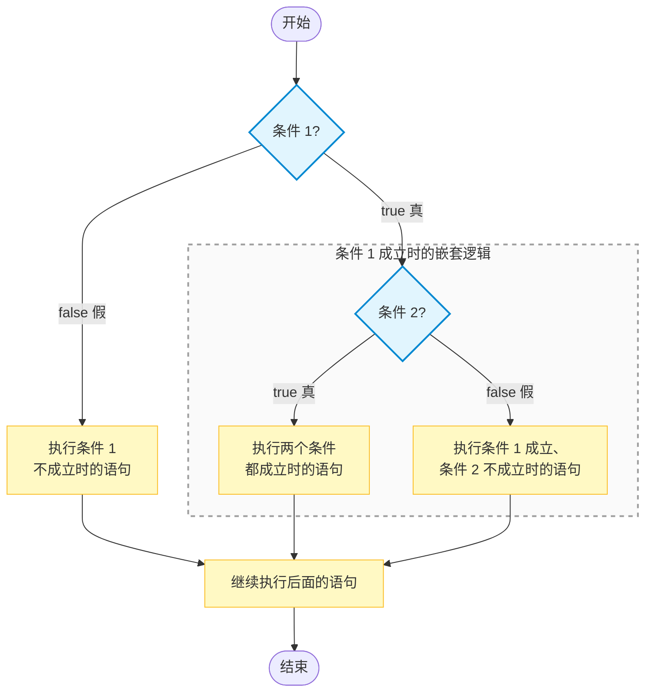
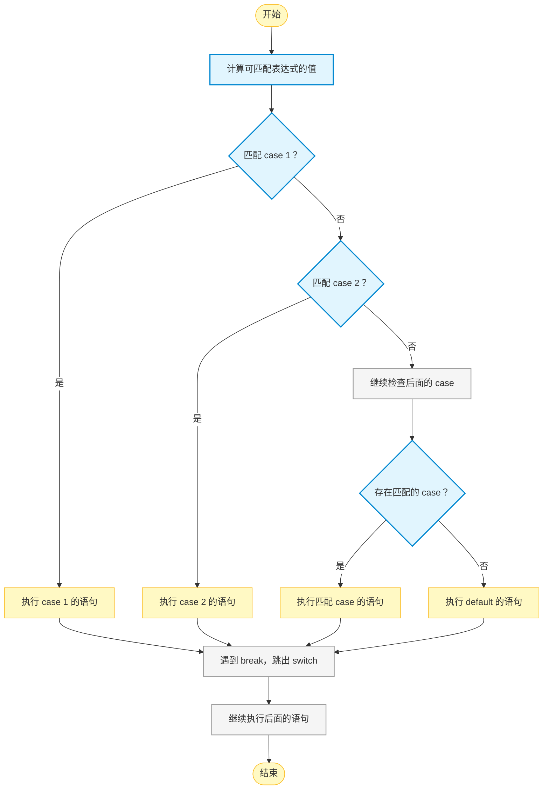

# C1-04 复杂的分支结构

`if` 嵌套、逻辑运算符与 `switch` 语句

> 学习目标：理解什么时候需要多个条件共同判断；学会使用嵌套 `if` 分层处理条件；掌握 `&&`、`||`、`!` 三个逻辑运算符及其短路求值特点；能够用逻辑运算符写出范围和组合条件；了解 `switch` 语句的适用场景、`case`、`break` 与 `default` 的作用。

## 一、为什么需要更复杂的分支

### 1\. 第三课的分支有什么局限

第三课中，我们用一个比较条件决定程序走哪条路：

```cpp
if (score >= 60) {
    cout << "及格" << endl;
} else {
    cout << "不及格" << endl;
}
```

这里的条件只有一个：`score >= 60`。

但有些问题不能只判断一个条件：

-   一个数在 `10` 到 `99` 之间，需要同时满足 `n >= 10` 和 `n <= 99`；
-   一个字符是字母，可能是小写字母，也可能是大写字母；
-   简易计算器要根据输入的运算符 `+`、`-`、`*`、`/` 选择不同的计算方法；
-   先判断是否及格，再把及格的同学分成“优秀”和“及格”两类。

这些问题都属于**复杂的分支结构**：程序需要组合多个条件、逐层判断，或根据一个值选择多个固定分支。

### 2\. 本课的三种工具

| 工具 | 核心作用 | 适合的情况 |
| --- | --- | --- |
| 嵌套 `if` | 在一个 `if` 里面继续判断 | 条件有先后顺序，像“先分大类，再分小类” |
| 逻辑运算符 | 把多个条件合成一个条件 | 条件之间是“并且”“或者”“取反”关系 |
| `switch` | 根据同一个值匹配多个固定选项 | 等值判断，例如星期几、菜单编号、运算符 |

可以把它们记成：

```text
层层判断 → 嵌套 if
组合条件 → &&、||、!
固定选项 → switch
```

### 3\. 本课的学习范围

本课仍然只讨论分支结构，不学习循环。

逻辑运算符可以把多个比较条件组合起来，例如：

```cpp
n >= 10 && n <= 99
(ch >= 'a' && ch <= 'z') || (ch >= 'A' && ch <= 'Z')
```

后续学习循环后，复杂条件还会经常和 `for`、`while` 一起使用。

## 二、嵌套 `if`：先分大类，再分小类

### 1\. 什么是嵌套 `if`

在一个 `if` 或 `else` 的花括号里，再写一个 `if`，叫作**嵌套 `if`**。

它适合有明显先后关系的判断。例如，先判断“是否及格”，只有及格后才继续判断“是否优秀”。

### 2\. 基本语法

```cpp
if (条件 1) {
    if (条件 2) {
        // 条件 1、条件 2 都成立时执行
    } else {
        // 条件 1 成立、条件 2 不成立时执行
    }
} else {
    // 条件 1 不成立时执行
}
```

### 3\. 嵌套 `if` 的流程图



外层条件不成立时，程序不会进入内层，所以内层条件也不会被判断。

### 4\. 示例：判断优秀、及格和不及格

```cpp
int score;
cin >> score;

if (score >= 60) {
    if (score >= 90) {
        cout << "优秀" << endl;
    } else {
        cout << "及格" << endl;
    }
} else {
    cout << "不及格" << endl;
}
```

输入 `95` 时：

1.  `score >= 60` 成立，进入外层 `if`；
2.  `score >= 90` 也成立，输出“优秀”。

输入 `75` 时，外层条件成立、内层条件不成立，输出“及格”。

输入 `50` 时，外层条件不成立，直接输出“不及格”，内层条件不会执行。

### 5\. 嵌套时一定加花括号

嵌套 `if` 中，`else` 会和最近的、还没有配对的 `if` 配对。这叫作**悬空 `else`**问题。

下面的缩进看起来像是 `else` 对应第一个 `if`：

```cpp
if (a > 0)
    if (b > 0)
        cout << "A" << endl;
else
    cout << "B" << endl;
```

实际上，它等价于：

```cpp
if (a > 0) {
    if (b > 0) {
        cout << "A" << endl;
    } else {
        cout << "B" << endl;    // else 对应内层 if
    }
}
```

> **关键规则：** `else` 总是与最近的、未配对的 `if` 配对；缩进不会改变配对关系。

因此，嵌套 `if` 时要**一律加花括号**：

```cpp
if (a > 0) {
    if (b > 0) {
        cout << "A" << endl;
    }
} else {
    cout << "B" << endl;        // 现在 else 明确对应外层 if
}
```

### 6\. 什么时候适合用嵌套 `if`

嵌套 `if` 的重点不是“能不能写”，而是“写出来是否更清楚”。

适合嵌套的情况：

-   外层判断决定内层判断是否有必要；
-   不同层次需要输出不同的处理结果；
-   程序逻辑本身就是“先……再……”。

如果只是几个并列条件都要满足，使用下一节的 `&&` 往往更简洁。

## 三、逻辑运算符：把多个条件组合起来

### 1\. 什么是逻辑运算符

**逻辑运算符**用来连接或改变条件的真、假结果。连接后得到的新条件叫作**复合条件**，结果仍然是 `true` 或 `false`。

例如：

```cpp
n >= 10 && n <= 99
```

左边和右边都是比较条件；它们通过 `&&` 连接，组成一个复合条件。

### 2\. 三个逻辑运算符

| 运算符 | 名称 | 读法和含义 | 示例 |
| --- | --- | --- | --- |
| `&&` | 逻辑与 | “并且”；两边都真才真 | `a > 0 && b > 0` |
| \` |  | \` | 逻辑或 |
| `!` | 逻辑非 | “非”；把真变假、把假变真 | `!(a > 0)` |

如果单独输出逻辑表达式的结果，也要把整个表达式放进括号：

```cpp
cout << (3 < 4 && 5 > 2) << endl;   // 输出 1
cout << (3 > 4 || 5 < 2) << endl;   // 输出 0
cout << !(3 < 4) << endl;           // 输出 0
```

因为输出运算符 `<<` 的优先级高于比较和逻辑运算符，括号可以保证先计算完整的条件。

### 3\. `&&`：两边都成立

`&&` 表示“并且”。只有左右两边的条件都成立，整个条件才成立。

| 条件 A | 条件 B | `A && B` |
| --- | --- | --- |
| 真 | 真 | 真 |
| 真 | 假 | 假 |
| 假 | 真 | 假 |
| 假 | 假 | 假 |

例如，判断一个整数是否是两位数：

```cpp
int n;
cin >> n;

if (n >= 10 && n <= 99) {
    cout << "是两位数" << endl;
} else {
    cout << "不是两位数" << endl;
}
```

`n >= 10` 和 `n <= 99` 必须同时成立。

> **注意：** 不能写成 `10 <= n <= 99`。C++ 会先计算 `10 <= n`，得到 `0` 或 `1`，再把它和 `99` 比较，结果不是“判断范围”。

### 4\. `||`：至少一边成立

`||` 表示“或者”。只要左右两边至少有一个条件成立，整个条件就成立。

| 条件 A | 条件 B | `A || B` |  
| --- | --- | --- |  
| 真 | 真 | 真 |  
| 真 | 假 | 真 |  
| 假 | 真 | 真 |  
| 假 | 假 | 假 |

例如，判断一个字符是否是英文字母：

```cpp
char ch;
cin >> ch;

if ((ch >= 'a' && ch <= 'z') || (ch >= 'A' && ch <= 'Z')) {
    cout << "yes" << endl;
} else {
    cout << "no" << endl;
}
```

这里有两种可能：

-   `ch` 在 `'a'` 到 `'z'` 之间，是小写字母；
-   `ch` 在 `'A'` 到 `'Z'` 之间，是大写字母。

两种情况满足一种即可，所以用 `||` 连接。两个范围各自用括号包起来，代码会更清楚。

### 5\. `!`：把条件取反

`!` 表示“不是”。它会把一个条件的结果反过来。

| 条件 A | `!A` |
| --- | --- |
| 真 | 假 |
| 假 | 真 |

```cpp
int n = 5;

cout << !(n > 0) << endl;   // n > 0 为真，取反后输出 0
cout << !(n < 0) << endl;   // n < 0 为假，取反后输出 1
```

简单条件通常可以直接改写，读起来更自然：

```cpp
!(n > 0)     // n 不大于 0
n <= 0       // 含义相同，更直接
```

`!` 更适合给一个较复杂的整体条件取反。

### 6\. 德摩根定律：与、或的否定

当 `!` 放在一个由 `&&` 或 `||` 连接的整体条件前面时，不能只把最前面的一个条件取反。需要同时完成两件事：

1.  括号里的每个条件分别取反；
2.  `&&` 和 `||` 互换。

这就是**德摩根定律**，也叫**反演律**。

#### “与”的否定

```cpp
!(条件 1 && 条件 2)
```

等价于：

```cpp
(!条件 1 || !条件 2)
```

也就是说：

```text
不是“条件 1 并且条件 2”成立
↓
条件 1 不成立，或者条件 2 不成立
```

例如：

```cpp
!(a > 0 && b > 0)
```

等价于：

```cpp
a <= 0 || b <= 0
```

“`a` 和 `b` 不都是正数”，就是“`a` 不是正数，或者 `b` 不是正数”。

#### “或”的否定

```cpp
!(条件 1 || 条件 2)
```

等价于：

```cpp
(!条件 1 && !条件 2)
```

也就是说：

```text
不是“条件 1 或者条件 2”成立
↓
条件 1 不成立，并且条件 2 不成立
```

例如：

```cpp
!(a > 0 || b > 0)
```

等价于：

```cpp
a <= 0 && b <= 0
```

“`a` 和 `b` 中没有正数”，就是“`a` 不是正数，并且 `b` 也不是正数”。

#### 用表格理解

| 原条件 | 取反后的等价条件 |
| :-- | :-- |
| `!(条件 1 && 条件 2)` | \`!条件 1 |
| \`!(条件 1 |  |

可以记成一句话：

```text
整体取反：每个条件都取反，同时 && 和 || 互换。
```

在具体比较条件中，常见的取反关系包括：

| 原条件 | 取反后 |
| :-: | :-: |
| `x > 0` | `x <= 0` |
| `x >= 10` | `x < 10` |
| `x == 5` | `x != 5` |
| `x != 5` | `x == 5` |

> **注意：** `!(A && B)` 不能写成 `!A && !B`；`!(A || B)` 也不能写成 `!A || !B`。运算符 `&&` 和 `||` 必须互换。

### 6\. 逻辑运算符的计算顺序

比较运算符会先算，再进行逻辑运算。逻辑运算符之间的优先级是：

```text
!（非）  >  &&（且）  >  ||（或）
```

因此：

```cpp
a || b && c
```

等价于：

```cpp
a || (b && c)
```

不过，初学阶段不要依赖记忆优先级。条件稍复杂时，主动加括号：

```cpp
if ((year % 4 == 0 && year % 100 != 0) || year % 400 == 0) {
    cout << "闰年" << endl;
}
```

### 7\. 短路求值：有些条件不会继续计算

`&&` 和 `||` 都具有**短路求值**特点：

-   `A && B`：如果 `A` 已经为假，`B` 不再计算，因为结果一定为假；
-   `A || B`：如果 `A` 已经为真，`B` 不再计算，因为结果一定为真。

短路求值可以避免危险操作。例如，除法前要先确认除数不为 `0`：

```cpp
int a, b;
cin >> a >> b;

if (b != 0 && a / b > 2) {
    cout << "商大于 2" << endl;
}
```

当 `b == 0` 时，左边 `b != 0` 为假，右边的 `a / b` 不会计算，因此不会发生除以 `0`。

下面的顺序则是危险的：

```cpp
if (a / b > 2 && b != 0) {   // b 为 0 时，已经先做了除法
    cout << "商大于 2" << endl;
}
```

> **记忆：** 用 `&&` 做安全检查时，把“安全条件”放在左边，把可能出错的操作放在右边。

### 8\. 综合示例：判断闰年

闰年满足下面两种情况中的一种：

1.  能被 `4` 整除，并且不能被 `100` 整除；
2.  能被 `400` 整除。

```cpp
int year;
cin >> year;

if ((year % 4 == 0 && year % 100 != 0) || year % 400 == 0) {
    cout << "闰年" << endl;
} else {
    cout << "平年" << endl;
}
```

建议用下面四个年份测试：

| 年份 | 结果 | 原因 |
| --- | --- | --- |
| `2000` | 闰年 | 能被 `400` 整除 |
| `1900` | 平年 | 能被 `100` 整除，但不能被 `400` 整除 |
| `2004` | 闰年 | 能被 `4` 整除，且不能被 `100` 整除 |
| `2001` | 平年 | 不能被 `4` 整除 |

## 四、嵌套 `if` 和逻辑运算符怎样选择

有些题目可以同时写成嵌套 `if` 和逻辑运算符两种形式。

例如，判断 `n` 是否为两位数：

```cpp
// 嵌套 if 写法
if (n >= 10) {
    if (n <= 99) {
        cout << "是两位数" << endl;
    }
}

// 逻辑运算符写法
if (n >= 10 && n <= 99) {
    cout << "是两位数" << endl;
}
```

在这个例子中，`&&` 更简洁；但在需要对不同情况分别处理时，嵌套 `if` 更清楚。

| 场景 | 更适合的写法 |
| --- | --- |
| 多个并列条件必须同时满足 | `&&` |
| 多种情况满足一种即可 | \` |
| 先判断大类，再根据结果判断小类 | 嵌套 `if` |
| 每一层失败时都要给出不同提示 | 嵌套 `if` |
| 条件很长、很复杂 | 用括号分组，必要时拆成嵌套 `if` |

嵌套层数太多会让代码不断向右缩进。一般超过三层时，应考虑能否拆分条件或调整判断顺序。

## 五、`switch`：一个值对应多个固定选项

### 1\. `switch` 适合什么问题

**`switch` 语句**会计算一个表达式的值，再根据这个值匹配不同的 `case`。

例如，输入 `1`、`2`、`3` 分别表示不同菜单选项；输入 `+`、`-`、`*`、`/` 表示不同运算符。这些都是“同一个值与多个固定值比较”的问题。

`switch` 适合：

```cpp
day == 1
day == 2
day == 3
```

`switch` 不适合判断大小范围：

```cpp
score >= 60
age < 18
```

范围判断仍然使用 `if-else if-else`。

### 2\. 基本语法

```cpp
switch (表达式) {
    case 值 1: {
        // 表达式等于值 1 时执行
        break;
    }
    case 值 2: {
        // 表达式等于值 2 时执行
        break;
    }
    default: {
        // 所有 case 都不匹配时执行
        break;
    }
}
```

> **推荐写法：** 每个 `case` 和 `default` 后面都加花括号。这样每个分支都有清楚的范围，可以减少变量声明、缩进和漏写语句造成的错误。`break` 写在花括号里面，仍然表示跳出整个 `switch`。

### 3\. `switch` 的流程图



### 4\. `case`、`break` 和 `default`

| 部分 | 作用 | 注意事项 |
| --- | --- | --- |
| `case 值:` | 表示一种固定取值 | `值` 必须是常量，多个 `case` 的值不能重复 |
| `break;` | 立刻跳出整个 `switch` | 大多数 `case` 末尾都要写 |
| `default:` | 所有 `case` 都不匹配时执行 | 类似 `if-else` 中的 `else`，建议保留 |

### 5\. `switch` 条件表达式可以放什么

`switch (表达式)` 中的表达式，最终必须能够得到**整数类型、字符类型或枚举类型**的值。初学阶段可以按下面的范围理解：

| 可以使用 | 示例 | 说明 |
| :-: | :-- | :-- |
| 整数变量 | `int n`、`long long n` | 根据整数值匹配 `case` |
| 字符变量 | `char op` | 字符本质上也有整数编码，适合匹配 `case '+'` |
| 布尔值 | `bool ok` | 语法上可以使用，但通常不如 `if` 清楚 |
| 枚举值 | `Color color` | 枚举的每个选项可以作为固定分支 |
| 结果为整数或字符的表达式 | `x % 3`、`day + 1` | 先计算表达式，再匹配结果 |

例如，下面的写法可以使用：

```cpp
int n;
cin >> n;

switch (n % 3) {
    case 0: {
        cout << "余数是 0" << endl;
        break;
    }
    case 1: {
        cout << "余数是 1" << endl;
        break;
    }
    case 2: {
        cout << "余数是 2" << endl;
        break;
    }
}
```

下面这些类型或写法不能直接用于 `switch`：

| 不能直接使用 | 示例 | 应该怎么做 |
| :-: | :-- | :-- |
| 小数类型 | `float`、`double` | 使用 `if-else` 判断范围或小数关系 |
| 字符串 | `string`、`std::string` | 使用 `if-else` 比较字符串，或转换成编号 |
| 字符串字面量 | `switch ("add")` | 使用字符 `case '+'`，或用 `if (command == "add")` |
| 范围条件 | `case score >= 60:` | 使用 `if-else if-else` |

例如，下面的写法是错误的：

```cpp
double score;
cin >> score;

// 错误：switch 不能直接判断 double
switch (score) {
    // ...
}
```

> **补充说明：** 比较表达式的结果是 `bool`，所以 `switch (x > 0)` 在语法上可能成立，但它实际上只有“真”和“假”两个选项，直接使用 `if (x > 0)` 更清楚。`switch` 最适合的是一个值对应多个固定选项。

### 6\. `case` 标签可以写什么

`case` 后面的值必须是**编译时就能确定的整数常量、字符常量或枚举常量**：

```cpp
const int MENU_START = 1;

switch (choice) {
    case MENU_START: {
        cout << "开始" << endl;
        break;
    }
    case 2 + 1: {
        cout << "设置" << endl;
        break;
    }
    default: {
        cout << "未知选项" << endl;
        break;
    }
}
```

不能把普通变量、`double`、字符串或范围写在 `case` 后面：

```cpp
int x = 2;

switch (choice) {
    // 错误：x 不是编译时常量
    case x: {
        break;
    }

    // 错误：case 不能表示范围
    // case 1 <= choice <= 3:

    // 错误：字符串不是字符常量
    // case "add":
}
```

多个 `case` 的值也不能重复，否则同一个输入无法确定应该进入哪一个分支。

### 7\. 示例：根据星期编号输出星期

```cpp
int day;
cin >> day;

switch (day) {
    case 1: {
        cout << "星期一" << endl;
        break;
    }
    case 2: {
        cout << "星期二" << endl;
        break;
    }
    case 3: {
        cout << "星期三" << endl;
        break;
    }
    default: {
        cout << "输入有误" << endl;
        break;
    }
}
```

输入 `2` 时，程序从 `case 2:` 开始执行，输出“星期二”，遇到 `break` 后跳出 `switch`。

### 8\. 示例：简易计算器

运算符是一个字符，特别适合用 `switch` 判断。

```cpp
int a, b;
char op;
cin >> a >> op >> b;

switch (op) {
    case '+': {
        cout << a + b << endl;
        break;
    }
    case '-': {
        cout << a - b << endl;
        break;
    }
    case '*': {
        cout << a * b << endl;
        break;
    }
    case '/': {
        if (b == 0) {
            cout << "除数不能为 0" << endl;
        } else {
            cout << a / b << endl;
        }
        break;
    }
    default: {
        cout << "未知运算符" << endl;
        break;
    }
}
```

这个例子说明：`switch` 的某个 `case` 内部仍然可以继续写 `if-else`。当运算符是 `/` 时，还需要判断除数是否为 `0`。

> **注意：** 字符常量使用英文单引号，例如 `case '+':`；不能写成 `case "+":`。

### 9\. 忘记 `break` 会发生什么

如果 `case` 末尾忘记写 `break`，程序会继续执行后面的 `case`，这种现象叫作**穿透**。

```cpp
int n = 1;

switch (n) {
    case 1: {
        cout << "A" << endl;
    }
    case 2: {
        cout << "B" << endl;
        break;
    }
}
```

上面会输出：

```text
A
B
```

因为 `case 1` 执行完后没有 `break`，程序继续执行了 `case 2`。

初学阶段可以记住：除非明确想让多个 `case` 共用后面的语句，否则每个 `case` 后面都写 `break;`。即使要演示穿透，也建议保留每个 `case` 的花括号，让分支范围清楚。

### 10\. `switch` 和 `if-else if` 的选择

| 情况 | 推荐写法 |
| --- | --- |
| 判断一个值是否等于多个固定选项 | `switch` |
| 判断范围，如分数等级、年龄区间 | `if-else if-else` |
| 条件中有 `&&`、\` |  |
| 某个 `case` 内还要继续判断特殊情况 | `switch` 内嵌 `if` |

## 六、常见错误与注意事项

### 1\. 有编译器提示的错误

| 编号 | 错误 | 识别信息（关键特征） | 后果 | 改正 |
| --- | --- | --- | --- | --- |
| E1 | `case` 后写变量，如 `case x:` | 常见 `not usable in a constant expression` | `case` 不能使用普通变量 | 写成固定常量，如 `case 1:` |
| E2 | `switch` 判断 `double` | 常见 `switch quantity not an integer` | `switch` 不能直接判断小数 | 改用 `if-else` |
| E3 | 字符 `case` 写成双引号，如 `case "+":` | 常见 `case label does not reduce to an integer constant` | 双引号是字符串，不是单个字符 | 使用 `case '+':` |
| E4 | 花括号或圆括号没有配对 | 常见 `expected '}'`、`expected ')'` | 分支结构无法正确编译 | 检查 `{ }` 和 `( )` 是否成对 |

### 2\. 没有固定报错，但结果或逻辑不对

下面的问题通常可以编译通过，需要通过阅读代码和测试数据发现。

| 编号 | 错误 | 识别信息（关键特征） | 后果 | 改正 |
| --- | --- | --- | --- | --- |
| E5 | `&&` 写成 `&`，或 \` |  | `写成` | \` |
| E6 | 把“且”写成 \` |  | `，或把“或”写成` &&\` | 用一组只满足部分条件的数据测试 |
| E7 | 范围判断写成 `10 <= n <= 99` | 出现连续两个比较运算符 | C++ 会分两次比较，结果错误 | 写成 `n >= 10 && n <= 99` |
| E8 | 复杂条件没有分组 | `&&`、\` |  | \` 同时出现且没有括号 |
| E9 | 安全检查写在 `&&` 右边 | 先发生除法、数组访问等危险操作 | 可能出现运行错误 | 先检查安全条件，例如 `b != 0 && a / b > 2` |
| E10 | 嵌套 `if` 没有花括号 | `else` 的缩进看起来不清楚 | `else` 可能配对到错误的 `if` | 嵌套时一律加花括号 |
| E11 | `case` 后漏写 `break` | 一个输入却输出了多个分支的内容 | 发生穿透，继续执行后面的 `case` | 在每个 `case` 末尾写 `break;` |
| E12 | 用 `switch` 判断范围 | 写出类似 `case score >= 60:` | `case` 不能表示范围 | 范围判断使用 `if-else if-else` |
| E13 | 没有处理未匹配的输入 | 只写了几个 `case`，没有 `default` | 非法输入时没有输出 | 根据题意添加 `default` |

### 3\. 分支题怎样测试

复杂分支不能只测试一个“普通样例”，还要测试每一条路。

例如，判断两位数时，至少测试：

```text
9    不是两位数
10   是两位数
99   是两位数
100  不是两位数
```

例如，简易计算器至少测试：

```text
3 + 4    加法分支
8 / 2    除法分支
8 / 0    除数为 0 的特殊分支
5 ^ 2    default 分支
```

> **测试习惯：** 每个分支至少走一次；涉及边界时，测试边界前、边界和边界后三种数据。

## 七、本课小结

```text
多个条件都要满足       → &&
多个条件满足一个即可   → ||
把一个条件反过来       → !
先分大类，再分小类     → 嵌套 if
一个值匹配固定选项     → switch
```

写复杂条件时，记住三件事：

1.  先用中文说清楚条件之间是“且”还是“或”；
2.  复杂条件主动加括号，嵌套 `if` 一律加花括号；
3.  `switch` 只处理固定的等值选项，大多数 `case` 后面要写 `break;`。