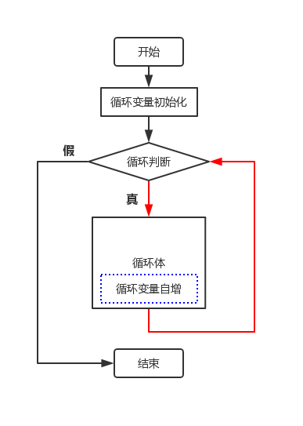
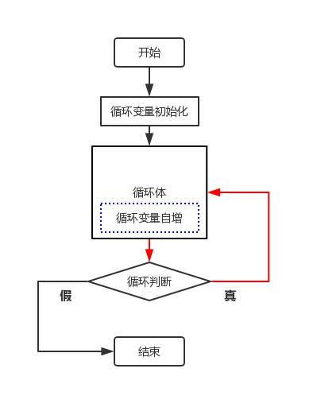

# C1-05 `while` 和 `do-while` 循环

`while` 循环、循环三要素与 `do-while` 循环

> 学习目标：理解程序为什么需要重复执行；掌握 `while` 循环的基本语法和“先判断后执行”的流程；理解初始化、条件、更新三个循环要素；能够使用 `while` 完成计数、累加和逐位处理；了解 `do-while` 的“先执行后判断”特点，并能根据题意选择合适的循环。

## 一、为什么需要循环

### 1\. 重复写语句太麻烦

如果要输出 5 次 `Hello`，可以这样写：

```cpp
cout << "Hello" << endl;
cout << "Hello" << endl;
cout << "Hello" << endl;
cout << "Hello" << endl;
cout << "Hello" << endl;
```

如果要输出 1000 次，就要重复写 1000 行。这样的程序不仅很长，也容易漏写或写错。

程序中经常会遇到“重复做同一件事”的问题：

-   输出 `1` 到 `n`；
-   计算 `1 + 2 + 3 + ... + n`；
-   不断把一个数除以 `10`，直到它变成 `0`；
-   不知道要重复多少次，只知道满足某个条件时继续。

这时可以使用**循环结构**。循环结构让程序自动重复执行一段代码。

### 2\. `while` 的作用

`while` 的意思是“当……时”。只要条件成立，程序就重复执行循环体；条件不成立时，退出循环。

```cpp
while (条件) {
    // 重复执行的语句
}
```

可以把它理解成：

```text
只要条件为真，就继续做
```

### 3\. `while` 特别适合什么情况

`while` 适合“根据条件决定什么时候停止”的问题。例如：

-   只要 `i <= n`，就继续输出；
-   只要数字还没有变成 `0`，就继续处理；
-   只要木棍长度大于 `1`，就继续缩短。

有时循环次数是已知的，有时循环次数是未知的。`while` 两种情况都可以处理，但它尤其适合**循环次数不容易提前确定**的场景。

## 二、`while` 循环的基本语法

### 1\. 基本语法

```cpp
while (条件) {
    循环体;
}
```

-   `while` 是循环关键字；
-   圆括号中的内容是**循环条件**；
-   花括号中的语句是**循环体**；
-   条件为 `true` 时执行循环体；
-   条件为 `false` 时退出循环。

### 2\. `while` 的流程图



### 3\. 最小示例：输出 1 到 5

```cpp
int i = 1;          // 初始化

while (i <= 5) {    // 条件
    cout << i << endl;
    i++;             // 更新
}
```

输出：

```text
1
2
3
4
5
```

执行过程如下：

1.  `i` 初始化为 `1`；
2.  判断 `i <= 5`，条件成立；
3.  输出 `i`；
4.  执行 `i++`，让 `i` 变成下一个数；
5.  回到第 2 步继续判断；
6.  当 `i` 变成 `6` 时，`i <= 5` 不成立，退出循环。

### 4\. `while` 的三个循环要素

一个正常的 `while` 循环通常有三个重要要素：

| 要素 | 作用 | 常见位置 |
| --- | --- | --- |
| 初始化 | 给循环变量一个起始值 | `while` 前面 |
| 条件 | 判断是否继续循环 | `while` 的圆括号中 |
| 更新 | 改变循环变量，使循环最终能够结束 | 循环体内部 |

例如：

```cpp
int i = 1;          // ① 初始化
while (i <= 5) {    // ② 条件
    cout << i << endl;
    i++;             // ③ 更新
}
```

> **关键提醒：** `while` 把三个要素分散在不同位置，尤其容易忘记写更新语句。写完循环后，要主动检查这三个要素是否齐全。

## 三、`while` 的执行特点

### 1\. 先判断，后执行

`while` 是**先判断后执行**。如果条件一开始就是假，循环体一次都不会执行：

```cpp
int i = 10;

while (i <= 5) {
    cout << i << endl;
    i++;
}

cout << "循环结束" << endl;
```

输出：

```text
循环结束
```

因为一开始 `10 <= 5` 就不成立，程序直接跳过循环体。

### 2\. 循环体可以执行多次，也可以执行 0 次

`while` 循环的执行次数取决于条件：

-   条件一开始为假：执行 `0` 次；
-   条件后来变假：执行若干次后退出；
-   条件一直为真：可能变成**死循环**。

### 3\. 用表格追踪循环

下面的程序输出 `1` 到 `3`：

```cpp
int i = 1;
while (i <= 3) {
    cout << i << endl;
    i++;
}
```

| 轮次 | 判断前的 `i` | `i <= 3` | 输出 | 更新后的 `i` |
| :---: | :--: | :---: | :---: | :--: |
| 第 1 轮 | 1 | 真 | 1 | 2 |
| 第 2 轮 | 2 | 真 | 2 | 3 |
| 第 3 轮 | 3 | 真 | 3 | 4 |
| 第 4 次判断 | 4 | 假 | 不执行 | 退出 |

遇到循环题时，可以手动列出这样的表格，检查变量是否按照预期变化。

## 四、`while` 的基本应用

### 1\. 计数：输出 1 到 `n`

```cpp
int n;
cin >> n;

int i = 1;
while (i <= n) {
    cout << i << " ";
    i++;
}
```

输入 `5`，输出：

```text
1 2 3 4 5
```

这里 `i` 既是循环变量，也是计数器。每轮循环输出一个数，再加 `1`。

### 2\. 倒序计数：输出 `n` 到 1

```cpp
int n;
cin >> n;

while (n >= 1) {
    cout << n << " ";
    n--;
}
```

输入 `5`，输出：

```text
5 4 3 2 1
```

这次循环变量每轮减 `1`，所以条件写成 `n >= 1`。

### 3\. 累加：计算 1 到 `n` 的和

```cpp
int n;
cin >> n;

long long sum = 0;
int i = 1;

while (i <= n) {
    sum += i;
    i++;
}

cout << sum << endl;
```

输入 `100`，输出：

```text
5050
```

这里有两个变量：

-   `i` 是循环计数器，表示当前加到哪一个数；
-   `sum` 是**累加器**，保存目前已经累加的结果。

累加器必须在循环外初始化为 `0`。如果把 `sum = 0` 写进循环体，每一轮都会清空之前的结果。

### 4\. 不断缩小：一尺之棰

有一根长度为 `a` 的木棍，每天把长度变为原来的一半，求第几天长度变为 `1`。

```cpp
int a;
cin >> a;

int day = 1;
while (a > 1) {
    a /= 2;
    day++;
}

cout << day << endl;
```

输入 `100`，输出：

```text
7
```

这里不知道需要重复几次，只知道“长度大于 `1` 就继续”，所以 `while` 比较自然。

### 5\. 逐位处理：求一个非负整数的位数

每次用整数除法 `n /= 10`，可以去掉数字的最后一位。

```cpp
int n;
cin >> n;

int count = 0;

if (n == 0) {
    count = 1;
} else {
    while (n > 0) {
        n /= 10;
        count++;
    }
}

cout << count << endl;
```

输入 `12345`，输出 `5`；输入 `0`，输出 `1`。

为什么要单独处理 `0`？

```cpp
while (n > 0)
```

当 `n` 为 `0` 时，条件一开始就是假，循环体执行 `0` 次。但数字 `0` 仍然有 `1` 位，所以需要特殊处理。后面学习 `do-while` 后，还可以用“至少执行一次”的方式解决这个问题。

### 6\. 逐位处理：翻转数字

翻转数字时，每轮取出原数的个位，接到新数字的末尾：

```cpp
int n;
cin >> n;

int rev = 0;

while (n > 0) {
    rev = rev * 10 + n % 10;
    n /= 10;
}

cout << rev << endl;
```

输入 `12345`，输出：

```text
54321
```

以 `123` 为例：

| 轮次 | `n` | `n % 10` | `rev` 更新后 | `n /= 10` 后 |
| :--: | :--: | :--: | :--: | :--: |
| 开始 | 123 | — | 0 | — |
| 第 1 轮 | 123 | 3 | 3 | 12 |
| 第 2 轮 | 12 | 2 | 32 | 1 |
| 第 3 轮 | 1 | 1 | 321 | 0 |
| 第 4 次判断 | 0 | — | 退出 | — |

输入 `1200` 时，结果是 `21`，因为翻转后开头的 `0` 不会被整数保留。

## 五、`do-while` 循环：先执行后判断

### 1\. 基本语法

```cpp
do {
    循环体;
} while (条件);
```

`do-while` 和 `while` 的最大区别是：它会先执行一次循环体，再判断条件。

> **关键区别：** `while` 是先判断后执行，可能执行 `0` 次；`do-while` 是先执行后判断，循环体至少执行 `1` 次。

### 2\. `do-while` 的流程图



### 3\. 最小示例：输出 1 到 5

```cpp
int i = 1;

do {
    cout << i << endl;
    i++;
} while (i <= 5);
```

**注意：`while (i <= 5);` 的末尾有一个分号。这是 `do-while` 语法的一部分，不能省略。**

### 4\. 条件一开始为假时

```cpp
int i = 10;

do {
    cout << i << endl;
    i++;
} while (i <= 5);
```

虽然一开始 `i <= 5` 为假，但程序仍然会先输出一次 `10`，然后才退出循环。

### 5\. 用 `do-while` 求位数

`do-while` 至少执行一次，所以 `n = 0` 时不需要额外的 `if`：

```cpp
int n;
cin >> n;

int count = 0;
do {
    n /= 10;
    count++;
} while (n > 0);

cout << count << endl;
```

输入 `0`，输出 `1`；输入 `12345`，输出 `5`。

## 六、`while` 和 `do-while` 的区别

| 对比项 | `while` | `do-while` |
| --- | --- | --- |
| 执行顺序 | 先判断，后执行 | 先执行，后判断 |
| 条件一开始为假 | 循环体执行 `0` 次 | 循环体仍执行 `1` 次 |
| 末尾分号 | 不需要额外分号 | `while (条件);` 必须有分号 |
| 适合场景 | 可能一次都不需要执行 | 无论如何至少先做一遍 |
| 常见例子 | 逐位处理、不断缩小、条件计数 | 求 `0` 的位数、菜单重复显示、输入验证 |

选择时可以这样想：

```text
先问“要不要做第一遍？”
├─ 可能一次都不做 → while
└─ 无论如何先做一遍 → do-while
```

在信奥入门题中，`while` 使用更普遍；只有题目明确要求至少执行一次，或者 `do-while` 能让代码更自然时，才使用 `do-while`。

## 七、常见错误与注意事项

### 1\. 有编译器提示的错误

| 编号 | 错误 | 识别信息（关键特征） | 后果 | 改正 |
| --- | --- | --- | --- | --- |
| E1 | `do-while` 的末尾漏写分号 | 常见 `expected ';' before '}'` 或 `expected ';'` | 编译器无法结束 `do-while` 语句 | 写成 `} while (条件);` |
| E2 | 花括号或圆括号没有配对 | 常见 `expected '}'`、`expected ')'` | 循环结构无法正确编译 | 检查 `{ }` 和 `( )` 是否成对 |
| E3 | 循环条件使用未定义变量 | 常见 `'i' was not declared in this scope` | 编译器找不到循环变量 | 先定义变量，再写循环 |
| E4 | `while` 条件中写入不合法表达式 | 常见 `expected primary-expression` | 条件无法计算 | 检查运算符和括号是否完整 |

### 2\. 没有固定报错，但结果或运行过程不对

下面的问题通常可以编译通过，需要通过阅读代码、测试数据或观察程序运行状态发现。

| 编号 | 错误 | 识别信息（关键特征） | 后果 | 改正 |
| --- | --- | --- | --- | --- |
| E5 | 忘记初始化循环变量 | 无固定报错；看到 `while` 前没有明确初值 | 条件结果不确定，程序行为不可预测 | 循环前完成初始化 |
| E6 | 忘记更新循环变量 | 程序长时间不结束，常见表现是持续输出或卡住 | 条件一直为真，形成死循环 | 在循环体内改变循环变量 |
| E7 | 条件写成赋值，如 `while (i = 1)` | 无固定报错；条件中出现单个 `=` | 把 `1` 赋给 `i`，结果为真，可能死循环 | 判断相等使用 `==` |
| E8 | `while` 后多写分号，如 `while (i <= 5);` | 无固定报错；看到 `while (...) ;` 要警惕 | 循环体变成空语句，后面的代码不受循环控制 | 删除多余分号 |
| E9 | 更新方向写反 | 无固定报错；变量越来越远离退出条件 | 循环不执行或死循环 | 检查条件和更新是否朝同一个退出方向变化 |
| E10 | 循环条件写反，如 `i >= n` 写成 `i <= n` | 无固定报错；边界数据结果异常 | 循环次数错误 | 对照题意检查“继续条件” |
| E11 | 累加器在循环体内重新初始化 | 无固定报错；结果只保留最后一轮 | 每轮都清空之前的累加结果 | 在循环外初始化一次 |
| E12 | 把 `while` 写成 `do-while` 或反过来 | 无固定报错；条件一开始为假时结果不同 | 少执行或多执行一次 | 根据“是否至少执行一次”选择 |
| E13 | 求位数时没有处理 `n == 0` | 无固定报错；输入 `0` 输出 `0` | `0` 的正确位数应为 `1` | 加特殊处理，或使用 `do-while` |
| E14 | 循环变量类型太小 | 可能出现负数、结果异常或无法退出 | 变量溢出后条件判断错误 | 根据数据范围选择 `long long` 等类型 |

### 3\. 死循环的识别与排查

**死循环**是指循环一直执行，永远不能退出。

错误示例：

```cpp
int i = 1;
while (i <= 5) {
    cout << i << endl;
    // 忘记 i++
}
```

`i` 一直是 `1`，所以 `i <= 5` 永远成立。

排查死循环时，依次检查：

1.  循环变量有没有初始化；
2.  循环体中有没有更新循环变量；
3.  更新后变量是否真的向“条件为假”的方向变化；
4.  条件中有没有把 `==` 错写成 `=`；
5.  是否在 `while` 后面误加了分号。

### 4\. `while` 后加分号的陷阱

错误写法：

```cpp
int i = 1;

while (i <= 5); {
    cout << i << endl;
    i++;
}
```

`while (i <= 5);` 后面的分号是一条空语句。循环真正执行的是“什么也不做”的空语句，`i` 又没有机会更新，因此程序会一直卡在循环中，后面的花括号也不属于 `while`。

正确写法：

```cpp
int i = 1;

while (i <= 5) {
    cout << i << endl;
    i++;
}
```