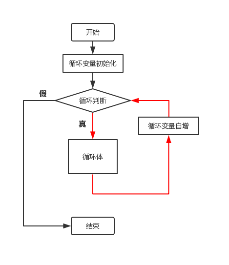

# C1-06 `for` 循环

`for` 循环、循环三要素与累加累乘

> 学习目标：理解程序为什么需要重复执行；掌握 `for` 循环的基本语法和执行顺序；理解初始化、条件、更新三个循环要素；能够使用 `for` 完成计数、倒序、指定步长、累加和累乘；知道如何检查循环边界、数据溢出和死循环。

## 一、为什么需要 `for` 循环

### 1\. 前几课的程序有什么局限

前几课中，每条语句通常只执行一次：顺序结构从上到下执行，分支结构根据条件选择一条路。

如果要输出 `1` 到 `5`，不用循环就要写很多条语句：

```cpp
cout << 1 << endl;
cout << 2 << endl;
cout << 3 << endl;
cout << 4 << endl;
cout << 5 << endl;
```

如果要输出 `1` 到 `1000`，或者计算 `1 + 2 + ... + 1000`，继续复制语句就非常麻烦。

**循环结构**可以让一段代码重复执行多次：

-   输出 `1` 到 `n`；
-   输出 `n` 个星号；
-   计算 `1` 到 `n` 的和；
-   计算 `n` 的阶乘；
-   按固定步长输出一组数字。

### 2\. 为什么先学习 `for`

前一课的 `while` 把初始化、条件和更新分散在不同位置：

```cpp
int i = 1;
while (i <= n) {
    cout << i << endl;
    i++;
}
```

`for` 把这三个部分集中在一行，结构更紧凑：

```cpp
for (int i = 1; i <= n; i++) {
    cout << i << endl;
}
```

当循环的起点、终点和步长比较清楚时，`for` 通常更方便。

## 二、`for` 循环的基本语法

### 1\. 基本语法

```cpp
for (初始化; 条件; 更新) {
    循环体;
}
```

`for` 圆括号中有三个部分，中间用两个英文分号隔开：

| 部分 | 作用 | 示例 |
| --- | --- | --- |
| 初始化 | 循环开始前执行一次，通常定义并设置循环变量 | `int i = 1` |
| 条件 | 每轮循环开始前判断，为真执行循环体，为假退出 | `i <= n` |
| 更新 | 每轮循环体执行完后改变循环变量 | `i++` |

### 2\. `for` 的流程图



### 3\. 最小示例：输出 1 到 5

```cpp
for (int i = 1; i <= 5; i++) {
    cout << i << endl;
}
```

输出：

```text
1
2
3
4
5
```

这里 `i` 从 `1` 开始，每次加 `1`，当 `i` 变成 `6` 时，条件 `i <= 5` 不成立，循环结束。

### 4\. `for` 的执行顺序

`for` 的执行顺序是：

1.  执行初始化，只执行一次；
2.  判断条件；
3.  条件为真，执行循环体；
4.  执行更新；
5.  回到第 2 步；
6.  条件为假，退出循环。

以 `for (int i = 1; i <= 3; i++)` 为例：

| 轮次 | 判断前的 `i` | `i <= 3` | 循环体 | 更新后的 `i` |
| :---: | :--: | :---: | :---: | :--: |
| 第 1 轮 | 1 | 真 | 执行 | 2 |
| 第 2 轮 | 2 | 真 | 执行 | 3 |
| 第 3 轮 | 3 | 真 | 执行 | 4 |
| 第 4 次判断 | 4 | 假 | 不执行 | 退出 |

> **关键提醒：** 更新是在循环体执行之后进行的，不是先更新再执行循环体。

## 三、循环变量的三个要素

### 1\. 起点、终点和步长

`for` 的三个部分可以用三个问题来检查：

| 要素 | 对应部分 | 要问自己的问题 |
| --- | --- | --- |
| 起点 | 初始化 | 从几开始？ |
| 终点 | 条件 | 到哪里结束？ |
| 步长 | 更新 | 每次变化多少？ |

例如：

```cpp
for (int i = 1; i <= 10; i += 2) {
    cout << i << " ";
}
```

-   起点是 `1`；
-   终点条件是 `i <= 10`；
-   步长是 `2`。

输出：

```text
1 3 5 7 9
```

### 2\. 两种循环 `n` 次的常见写法

```cpp
for (int i = 1; i <= n; i++) {
    // i 取 1, 2, ..., n
}
```

```cpp
for (int i = 0; i < n; i++) {
    // i 取 0, 1, ..., n-1
}
```

这两种写法都循环 `n` 次，但循环变量的取值范围不同。第一种更适合“打印 `1` 到 `n`”，第二种在以后学习数组下标时很常见。

### 3\. 循环变量的作用域

如果在 `for` 的初始化部分定义循环变量：

```cpp
for (int i = 1; i <= 5; i++) {
    cout << i << endl;
}
```

变量 `i` 只在 `for` 循环内部有效，循环外不能使用：

```cpp
cout << i << endl;     // 错误：i 已经超出作用域
```

如果确实需要在循环结束后继续使用 `i`，可以在循环外定义：

```cpp
int i;
for (i = 1; i <= 5; i++) {
    cout << i << endl;
}
cout << "循环结束时 i = " << i << endl;
```

## 四、`for` 循环的基本应用

### 1\. 计数：输出 1 到 `n`

```cpp
int n;
cin >> n;

for (int i = 1; i <= n; i++) {
    cout << i << '\n';
}
```

输入 `5`，输出：

```text
1
2
3
4
5
```

循环体中使用 `'\n'`，所以每个数字占一行。

### 2\. 输出 `n` 个星号

```cpp
int n;
cin >> n;

for (int i = 1; i <= n; i++) {
    cout << '*';
}
cout << '\n';
```

输入 `5`，输出：

```text
*****
```

循环体中没有换行，所以星号会连续输出在同一行；循环结束后再统一换行。

### 3\. 倒序循环：输出 `n` 到 1

```cpp
int n;
cin >> n;

for (int i = n; i >= 1; i--) {
    cout << i << '\n';
}
```

输入 `5`，输出：

```text
5
4
3
2
1
```

倒序循环的三个要素是：

-   起点较大；
-   条件使用 `>=`；
-   更新使用 `i--` 或 `i -= 1`。

### 4\. 指定步长：输出奇数

```cpp
int n;
cin >> n;

for (int i = 1; i <= n; i += 2) {
    cout << i << " ";
}
```

输入 `10`，输出：

```text
1 3 5 7 9
```

步长不一定是 `1`，可以使用 `i += 2`、`i += 5` 等写法。

### 5\. 累加：计算 1 到 `n` 的和

```cpp
int n;
cin >> n;

long long sum = 0;

for (int i = 1; i <= n; i++) {
    sum += i;
}

cout << sum << '\n';
```

输入 `100`，输出：

```text
5050
```

这里的 `sum` 是**累加器**：

1.  在循环外初始化 `sum = 0`；
2.  每轮执行 `sum += i`；
3.  循环结束后，`sum` 保存最终总和。

为什么初始化为 `0`？

```text
0 是加法的起点，不会改变第一次累加的结果。
```

如果把 `sum` 初始化为 `1`，结果就会多出 `1`。

### 6\. 累乘：计算 `n` 的阶乘

阶乘的定义是：

```text
n! = 1 × 2 × 3 × ... × n
```

代码如下：

```cpp
int n;
cin >> n;

long long product = 1;

for (int i = 1; i <= n; i++) {
    product *= i;
}

cout << product << '\n';
```

输入 `10`，输出：

```text
3628800
```

这里的 `product` 是**累乘器**，必须初始化为 `1`：

```text
1 是乘法的起点，不会改变第一次相乘的结果。
```

如果把 `product` 初始化为 `0`，之后无论乘什么，结果都会一直是 `0`。

> **数据范围提醒：** 阶乘增长很快。`13!` 已经超过 `int` 的常见范围，求阶乘通常使用 `long long`，并根据题目范围判断是否还会溢出。

## 五、复合赋值运算符

循环中经常要把计算结果重新放回原变量，C++ 提供了简写形式：

| 简写 | 等价写法 | 含义 |
| --- | --- | --- |
| `sum += i` | `sum = sum + i` | 加后赋值 |
| `product *= i` | `product = product * i` | 乘后赋值 |
| `i += 2` | `i = i + 2` | 每次加 2 |
| `i -= 1` | `i = i - 1` | 每次减 1 |
| `i++` | `i = i + 1` | 每次加 1 |
| `i--` | `i = i - 1` | 每次减 1 |

例如：

```cpp
for (int i = 1; i <= 5; i += 2) {
    cout << i << " ";
}
```

等价于：

```cpp
for (int i = 1; i <= 5; i = i + 2) {
    cout << i << " ";
}
```

## 六、循环边界与常见变体

### 1\. `<` 和 `<=` 只差一次循环

```cpp
// i 取 1、2、3、4、5，共 5 次
for (int i = 1; i <= 5; i++) {
    cout << i << " ";
}
```

```cpp
// i 取 1、2、3、4，共 4 次
for (int i = 1; i < 5; i++) {
    cout << i << " ";
}
```

`i <= 5` 包含 `5`，`i < 5` 不包含 `5`。边界写错，程序可能少执行一次或多执行一次。

### 2\. 倒序时条件和更新要配套

正确：

```cpp
for (int i = 10; i >= 1; i--) {
    cout << i << " ";
}
```

错误：

```cpp
for (int i = 10; i <= 1; i--) {
    cout << i << " ";
}
```

第一次判断时，`10 <= 1` 就是假，循环体一次都不会执行。

### 3\. 可以省略哪些部分

`for` 的三个部分在语法上都可以省略，但两个分号必须保留：

```cpp
for (;;) {
    // 无限循环
}
```

这种写法会形成死循环，初学阶段不要随意使用。循环体即使只有一条语句，也建议保留花括号。

## 七、`for` 与 `while` 的对比

下面两段代码完成同样的任务：

```cpp
// for
for (int i = 1; i <= n; i++) {
    cout << i << '\n';
}
```

```cpp
// while
int i = 1;
while (i <= n) {
    cout << i << '\n';
    i++;
}
```

| 对比项 | `for` | `while` |
| --- | --- | --- |
| 三要素位置 | 初始化、条件、更新集中在一行 | 三要素分散在不同位置 |
| 适合场景 | 起点、终点、步长明确 | 只知道继续条件，次数不容易确定 |
| 典型例子 | 输出 `1` 到 `n`、求和、求阶乘 | 不断除以 `10`、不断缩小直到满足条件 |

> **选择建议：** 循环次数和步长清楚时，优先考虑 `for`；只知道什么时候停止、但不容易写出固定次数时，`while` 更自然。

## 八、常见错误与注意事项

### 1\. 有编译器提示的错误

| 编号 | 错误 | 识别信息（关键特征） | 后果 | 改正 |
| --- | --- | --- | --- | --- |
| E1 | 循环外使用 `for` 内定义的变量 | 常见 `'i' was not declared in this scope` | 循环变量已经超出作用域 | 在循环外定义变量，或只在循环内使用 |
| E2 | `for` 的括号或花括号没有配对 | 常见 `expected ')'`、`expected '}'` | 循环结构无法正确编译 | 检查 `( )` 和 `{ }` |
| E3 | 三个部分之间漏写分号 | 常见 `expected ';'` | `for` 语法结构不完整 | 写成 `for (初始化; 条件; 更新)` |

### 2\. 没有固定报错，但结果或运行过程不对

下面的问题通常可以编译通过，需要通过测试数据和阅读代码发现。

| 编号 | 错误 | 识别信息（关键特征） | 后果 | 改正 |
| --- | --- | --- | --- | --- |
| E4 | 把 `<=` 写成 `<` | 少执行一次，漏掉终点 | 根据题意决定是否包含终点 |  |
| E5 | 把 `<` 写成 `<=` | 多执行一次，超过终点 | 重新检查边界是否包含终点 |  |
| E6 | 忘记更新或写成 `i + 1` | 循环变量不变，程序可能死循环 | 使用 `i++`、`i += 1` 等更新写法 |  |
| E7 | 更新方向与条件矛盾 | 循环一次不执行或无法结束 | 正序用 `<`/`<=` 配合 `i++`，倒序用 `>`/`>=` 配合 `i--` |  |
| E8 | `for` 后多写分号，如 `for (...);` | 循环体变成空语句，后面的代码不受循环控制 | 删除多余分号 |  |
| E9 | 累加器初始化错误 | 求和结果多 1、少数值或不确定 | 累加器通常初始化为 `0` |  |
| E10 | 累乘器初始化为 `0` | 阶乘结果永远为 `0` | 累乘器初始化为 `1` |  |
| E11 | 使用 `int` 保存过大的和或阶乘 | 结果溢出，出现负数或异常值 | 根据范围使用 `long long` |  |
| E12 | 循环体输出换行位置不对 | 数字挤成一行或多出空行 | 区分循环内换行和循环后换行 |  |
| E13 | 只测试普通数据 | 边界或特殊情况可能错误 | 测试最小值、终点值和较大值 |  |

### 3\. 死循环的识别与排查

如果程序一直运行、不结束，可能发生了**死循环**。

错误示例：

```cpp
for (int i = 1; i <= 5; ) {
    cout << i << endl;
}
```

这里没有更新 `i`，所以 `i` 永远是 `1`，条件永远成立。

排查时依次检查：

1.  初始化是否正确；
2.  条件是否有可能变成假；
3.  更新是否真的改变了循环变量；
4.  更新方向是否和条件配套；
5.  `for` 后面是否误加了分号。

### 4\. `for` 后多分号的陷阱

错误写法：

```cpp
for (int i = 1; i <= 5; i++); {
    cout << i << endl;
}
```

这个分号让 `for` 的循环体变成了空语句。后面的花括号只是普通代码块，不属于循环；同时，`i` 只在 `for` 内有效，循环外使用还会产生作用域错误。

正确写法：

```cpp
for (int i = 1; i <= 5; i++) {
    cout << i << endl;
}
```