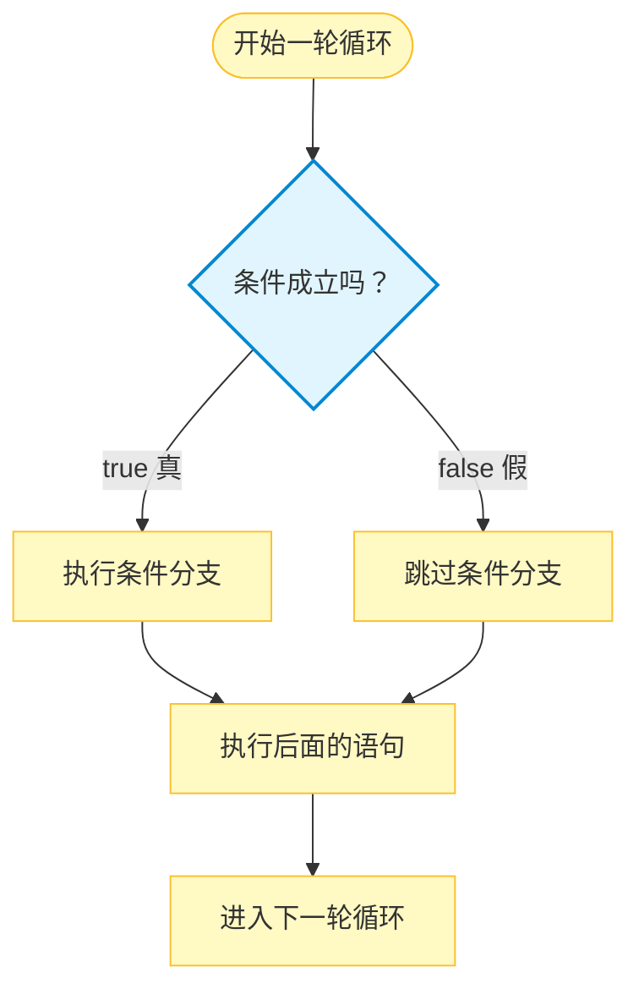

# C1-09 循环与分支

循环中的条件判断、`continue` 与 `break`

> 学习目标：理解为什么要把循环和 `if` 组合使用；能够在循环中进行筛选、分类、条件求和和条件计数；掌握 `continue`“跳过本次循环”和 `break`“结束整个循环”的区别；能够使用循环与分支完成求最值、查找第一个满足条件的数等基本问题；知道如何排查 `continue` 导致的死循环、最值初值错误和 `break`、`continue` 混用等问题。

## 一、为什么需要循环与分支

### 1\. 循环和分支分别解决什么问题

前面的课程分别学习了循环和分支：

-   循环让程序重复处理一批数据；
-   `if` 根据条件决定某段语句是否执行。

如果只使用循环，循环体中的每一轮通常做同样的事情；如果只使用 `if`，程序只能判断少量数据。实际问题经常需要：

```text
逐个处理数据 → 判断当前数据 → 根据判断结果进行不同操作
```

例如：

-   统计 `1` 到 `n` 中有多少个偶数；
-   求 `m` 到 `n` 之间所有奇数的和；
-   在一组数中求最大值和最小值；
-   找到第一个满足条件的数后立即停止。

这些问题都需要把循环和分支组合起来。

### 2\. 从单次判断过渡到循环判断

前面学习 `if` 时，程序通常只判断一个数据。本课把这个判断放进循环中，让程序逐个处理一批数据：

```cpp
for (int i = 1; i <= n; i++) {
    if (i % 2 == 0) {
        cout << i << ' ';
    }
}
```

循环负责不断产生或读入数据，`if` 负责判断当前数据。这样就能完成筛选、分类、统计和查找等任务。

## 二、循环与 `if` 的基本组合

### 1\. 基本模式

最常见的写法是在循环体内放一个 `if`：

```cpp
for (int i = 开始值; i <= 结束值; i++) {
    if (条件) {
        // 条件成立时执行
    }
}
```

循环负责“一个一个地处理”，`if` 负责“判断当前数据”。

### 2\. 最小示例：统计偶数个数

```cpp
int count = 0;

for (int i = 1; i <= 10; i++) {
    if (i % 2 == 0) {
        count++;
    }
}

cout << count << '\n';
```

输出：

```text
5
```

执行过程可以理解为：

1.  `for` 依次让 `i` 取 `1` 到 `10`；
2.  每轮用 `i % 2 == 0` 判断 `i` 是否为偶数；
3.  如果是偶数，计数器 `count` 加 `1`；
4.  循环结束后，`count` 就是偶数的个数。

### 3\. `if` 的执行流程



> **关键理解：** 循环决定“处理多少次”，`if` 决定“这一轮是否执行某个操作”。

### 4\. `if-else`：两类情况分别处理

如果条件成立和不成立时都需要做不同的事情，可以使用 `if-else`：

```cpp
for (int i = 1; i <= n; i++) {
    if (i % 2 == 0) {
        // 偶数的处理
    } else {
        // 奇数的处理
    }
}
```

例如，同时统计偶数和奇数的个数：

```cpp
int evenCount = 0;
int oddCount = 0;

for (int i = 1; i <= n; i++) {
    if (i % 2 == 0) {
        evenCount++;
    } else {
        oddCount++;
    }
}

cout << evenCount << ' ' << oddCount << '\n';
```

`if-else` 的两个分支每轮只会执行一个，不会同时执行。

## 三、`continue`：跳过本次循环

### 1\. 基本语法和作用

```cpp
continue;
```

`continue` 的意思是：**跳过本次循环中剩余的语句，直接进入下一次循环。**

它不会结束整个循环，只是不处理当前这一轮后面的内容。

可以这样记：

```text
continue = 这一轮不做了，下一轮继续
```

### 2\. 示例：跳过 3 的倍数

下面的程序输出 `1` 到 `n` 中不是 `3` 的倍数的数：

```cpp
int n;
cin >> n;

for (int i = 1; i <= n; i++) {
    if (i % 3 == 0) {
        continue;
    }
    cout << i << ' ';
}

cout << '\n';
```

输入：

```text
10
```

输出：

```text
1 2 4 5 7 8 10
```

当 `i` 为 `3`、`6`、`9` 时，执行 `continue`，后面的 `cout` 被跳过；然后循环继续处理下一个数。

### 3\. `continue` 在 `for` 中的执行顺序

对于下面的循环：

```cpp
for (int i = 1; i <= n; i++) {
    if (条件) {
        continue;
    }
    // 其他语句
}
```

遇到 `continue` 后，执行顺序是：

```text
跳过本轮剩余语句 → 执行 for 的更新 i++ → 再判断循环条件
```

因此，`for` 中的 `continue` 不会跳过 `i++`，通常不会因为忘记更新而死循环。

### 4\. 用 `continue` 求条件和

求 `1` 到 `10` 中奇数的和，可以先跳过偶数：

```cpp
int sum = 0;

for (int i = 1; i <= 10; i++) {
    if (i % 2 == 0) {
        continue;
    }
    sum += i;
}

cout << sum << '\n';
```

输出：

```text
25
```

这里 `continue` 把“偶数不参与累加”表达得很清楚。

不过，下面这种写法也完全正确：

```cpp
int sum = 0;

for (int i = 1; i <= 10; i++) {
    if (i % 2 != 0) {
        sum += i;
    }
}
```

两种写法的结果相同。条件较简单时，直接把操作写进 `if` 也很自然；当需要排除的情况较多、后面的代码较长时，`continue` 可以减少嵌套。

### 5\. `while` 中的 `continue` 陷阱

在 `while` 中，更新语句通常写在循环体内部。`continue` 会直接回到条件判断，如果更新语句在它后面，就可能永远执行不到。

错误示例：

```cpp
int i = 0;

while (i < 10) {
    if (i == 5) {
        continue;
    }
    cout << i << ' ';
    i++;
}
```

当 `i` 变成 `5` 时，程序执行 `continue`，跳过下面的 `i++`；下一次判断时 `i` 仍然是 `5`，于是会不断重复，形成死循环。

一种修改方法是把更新放到 `continue` 前面：

```cpp
int i = 0;

while (i < 10) {
    i++;
    if (i == 5) {
        continue;
    }
    cout << i << ' ';
}
```

初学阶段，如果循环次数明确，优先使用 `for`；如果必须在 `while` 中使用 `continue`，要检查每一条路径是否都会更新循环变量。

## 四、`break`：提前结束循环

### 1\. 基本语法和作用

```cpp
break;
```

`break` 的意思是：**立即结束当前循环，执行循环后面的语句。**

可以这样记：

```text
break = 不循环了，直接退出
```

`break` 和 `continue` 的区别：

| 语句 | 当前这一轮 | 后续循环 | 适合场景 |
| :-: | :-- | :-- | :-- |
| `continue` | 剩余语句不执行 | 继续 | 跳过不需要处理的数据 |
| `break` | 立即结束 | 不再进行 | 找到答案后停止搜索 |

### 2\. 示例：找到第一个大于 10 的数

```cpp
int n;
cin >> n;

int answer = -1;

for (int i = 0; i < n; i++) {
    int x;
    cin >> x;

    if (x > 10) {
        answer = x;
        break;
    }
}

if (answer == -1) {
    cout << "未找到" << '\n';
} else {
    cout << answer << '\n';
}
```

输入：

```text
5
3 7 15 2 18
```

输出：

```text
15
```

读到 `15` 后，`answer` 记录答案，`break` 立即结束循环，后面的 `2` 和 `18` 不再处理。

### 3\. 为什么查找“第一个”要使用 `break`

如果不使用 `break`，程序可能继续向后查找，并覆盖之前记录的答案：

```cpp
int answer = -1;

for (int i = 0; i < n; i++) {
    int x;
    cin >> x;
    if (x > 10) {
        answer = x;
    }
}
```

这段代码最后记录的是**最后一个**大于 `10` 的数，而不是第一个。

因此：

-   找第一个满足条件的数：找到后记录并 `break`；
-   找最后一个满足条件的数：不能提前 `break`，每次满足条件都更新答案；
-   统计所有满足条件的数：遍历全部数据，用累加器或计数器处理。

### 4\. `break` 只结束当前循环

`break` 只结束它所在的那一层循环。如果以后学习多层循环，要注意：

```text
break 只跳出当前所在的最内层循环
```

本课只使用单层循环，但提前了解这个规则，可以避免把 `break` 误认为“结束整个程序”。

## 五、经典应用一：条件求和与条件计数

### 1\. 条件求和

条件求和就是：只把满足条件的数据加入累加器。

例如，求 `m` 到 `n` 之间所有奇数的和：

```cpp
int m, n;
cin >> m >> n;

long long sum = 0;

for (int i = m; i <= n; i++) {
    if (i % 2 != 0) {
        sum += i;
    }
}

cout << sum << '\n';
```

核心结构是：

```text
遍历 → 判断 → 满足条件才累加
```

累加器 `sum` 要在循环外初始化为 `0`。

### 2\. 条件计数

条件计数就是：每发现一个满足条件的数据，计数器加 `1`。

例如，读入 `n` 个整数，统计其中正数的个数：

```cpp
int n;
cin >> n;

int count = 0;

for (int i = 0; i < n; i++) {
    long long x;
    cin >> x;

    if (x > 0) {
        count++;
    }
}

cout << count << '\n';
```

这里不需要保存所有数据，因为每个数读入后马上判断、马上计数即可。

### 3\. 同时求和和计数

同一次遍历中可以设置多个结果变量：

```cpp
int n;
cin >> n;

int count = 0;
long long sum = 0;

for (int i = 0; i < n; i++) {
    int x;
    cin >> x;

    if (x > 0) {
        count++;
        sum += x;
    }
}

cout << count << ' ' << sum << '\n';
```

一个 `if` 可以同时更新多个变量，只要这些变量的含义清楚即可。

### 4\. `if-else` 分类统计

如果要分别统计正数、负数和零，可以使用 `if-else if-else`：

```cpp
int positive = 0;
int negative = 0;
int zero = 0;

for (int i = 0; i < n; i++) {
    int x;
    cin >> x;

    if (x > 0) {
        positive++;
    } else if (x < 0) {
        negative++;
    } else {
        zero++;
    }
}

cout << positive << ' ' << negative << ' ' << zero << '\n';
```

每个数只会进入其中一个分支，因此三个计数器的总和应等于 `n`。

## 六、经典应用二：求最大值和最小值

### 1\. “打擂台”的思想

求最大值或最小值，可以把每次读入的数据想象成参加一场擂台赛：

```text
当前数据上场 → 和擂主比较 → 更优秀者成为新的擂主
```

-   求最大值时，当前更大的数成为新的“最大擂主”；
-   求最小值时，当前更小的数成为新的“最小擂主”。

代码中的 `maxValue` 和 `minValue` 就是擂主。每读入一个新数据，就用 `if` 比较并决定是否更新。程序不需要记住之前的所有数据，只需要记住当前擂主。

例如，依次读入：

```text
3  7  2  9  4
```

求最大值时的打擂台过程如下：

| 当前读入的数据 | 比较前的擂主 | 比较结果 | 比较后的擂主 |
| :-: | :-: | :-- | :-: |
| 第一个数据 `3` | — | 先让 `3` 当擂主 | `3` |
| `7` | `3` | `7` 更大，换擂主 | `7` |
| `2` | `7` | `2` 不够大，擂主不变 | `7` |
| `9` | `7` | `9` 更大，换擂主 | `9` |
| `4` | `9` | `4` 不够大，擂主不变 | `9` |

最后的擂主 `9` 就是最大值。

### 2\. 为什么不能随便把初值设为 `0`

错误思路：

```cpp
int maxValue = 0;
```

如果所有数据都是负数，例如 `-8 -3 -10`，程序会错误地保留 `0`，但 `0` 根本不在数据中。

求最小值时也不能随便写：

```cpp
int minValue = 0;
```

如果所有数据都是正数，例如 `5 8 3`，程序会错误地保留 `0`。

因此，初始化值必须满足下面的要求：

-   求最大值时，初值应该不大于所有可能的数据；
-   求最小值时，初值应该不小于所有可能的数据。

### 3\. 方法一：用第一个数据作为初始擂主

当题目保证至少有一个数据时，最稳妥、最推荐的方法是先读入第一个数据：

```cpp
int n;
cin >> n;

int x;
cin >> x;                 // 先读第一个数据

int maxValue = x;         // 第一个数据成为最大擂主
int minValue = x;         // 第一个数据成为最小擂主

for (int i = 1; i < n; i++) {
    cin >> x;

    if (x > maxValue) {
        maxValue = x;
    }
    if (x < minValue) {
        minValue = x;
    }
}

cout << maxValue << ' ' << minValue << '\n';
```

这种方法不需要猜数据范围。无论数据全是正数、全是负数，还是正负都有，都可以正确工作。

它要求 `n >= 1`，因为程序需要先读入一个数据作为初始擂主。

如果数据是 `-8 -3 -10 -5`，使用第一个数据 `-8` 作为初始擂主，之后的比较过程是：

| 当前读入的数据 | 比较前的最大擂主 | 比较结果 | 比较后的最大擂主 |
| :-: | :-: | :-- | :-: |
| 第一个数据 `-8` | — | 先让 `-8` 当擂主 | `-8` |
| `-3` | `-8` | `-3` 更大，换擂主 | `-3` |
| `-10` | `-3` | `-10` 不够大，擂主不变 | `-3` |
| `-5` | `-3` | `-5` 不够大，擂主不变 | `-3` |

最后最大值是 `-3`。这说明使用第一个数据初始化时，不怕数据全部为负数。

求最小值时，只需把比较方向改成 `<`：

```cpp
int n;
cin >> n;

int x;
cin >> x;

int minValue = x;         // 第一个数据先当最小擂主

for (int i = 1; i < n; i++) {
    cin >> x;
    if (x < minValue) {
        minValue = x;
    }
}

cout << minValue << '\n';
```

### 4\. 方法二：用范围外的极值作为初始值

如果题目明确给出了数据范围，也可以把初始值设置为一个“不会被误认为答案”的极值。

例如，题目保证每个整数都在 `-1e9` 到 `1e9` 之间：

```cpp
int n;
cin >> n;

int maxValue = -1e9;      // 最大值擂主：比所有可能的数据都小或相等
int minValue = 1e9;       // 最小值擂主：比所有可能的数据都大或相等

for (int i = 0; i < n; i++) {
    int x;
    cin >> x;

    if (x > maxValue) {
        maxValue = x;
    }
    if (x < minValue) {
        minValue = x;
    }
}

cout << maxValue << ' ' << minValue << '\n';
```

这里的 `-1e9` 和 `1e9` 不是“随便写的神奇数字”，而是根据题目范围选择的。可以把它们理解为：

-   `maxValue` 的初值要不大于所有可能的数据；
-   `minValue` 的初值要不小于所有可能的数据。

如果题目使用 `int`，也可以使用标准库中的极值：

```cpp
#include <climits>

int maxValue = INT_MIN;
int minValue = INT_MAX;
```

如果数据范围是 `-10^18` 到 `10^18`，就不能继续使用 `int` 和 `1e9`，应改用 `long long`，并选择相应范围的初值，例如：

```cpp
long long maxValue = -1000000000000000000LL;
long long minValue =  1000000000000000000LL;
```

也可以写成：

```cpp
long long maxValue = LLONG_MIN;
long long minValue = LLONG_MAX;
```

使用这些初值时，必须确认题目中的数据类型和范围。`1e9`、`-1e9`、`1e18`、`-1e18` 都不是可以无条件套用的固定答案。

### 5\. 两种初始化方法怎样选择

| 方法 | 适用条件 | 优点 | 需要注意 |
| :-: | :-- | :-- | :-- |
| 第一个数据初始化 | 至少有一个数据，通常 `n >= 1` | 不需要猜范围，最稳妥 | 要先读入第一个数据 |
| 范围外极值初始化 | 题目明确给出数据范围 | 代码可以统一从第一个循环开始读 | 初值必须覆盖所有合法数据 |

一般建议：

```text
数据范围不确定 → 用第一个数据初始化
数据范围明确     → 可以用范围外的极值初始化
```

### 6\. 边读边比较，不必保存全部数据

无论采用哪种初始化方式，核心都是“边读边比较”：每个数据只需要和当前擂主比较一次，不需要保存全部数据。

```cpp
int n;
cin >> n;

int maxValue = INT_MIN;
int minValue = INT_MAX;

for (int i = 0; i < n; i++) {
    cin >> x;

    if (x > maxValue) {
        maxValue = x;
    }
    if (x < minValue) {
        minValue = x;
    }
}

cout << maxValue << ' ' << minValue << '\n';
```

### 7\. 同时求最大值、最小值和总和

同一次循环中可以完成多个任务：

```cpp
int n;
cin >> n;

int maxValue = INT_MIN;
int minValue = INT_MAX;
long long sum = 0;

for (int i = 0; i < n; i++) {
    cin >> x;

    if (x > maxValue) {
        maxValue = x;
    }
    if (x < minValue) {
        minValue = x;
    }
    sum += x;
}

cout << maxValue << ' ' << minValue << ' ' << sum << '\n';
```

## 七、经典应用三：查找与搜索

### 1\. 查找第一个满足条件的数

查找题通常使用一个结果变量记录答案：

```cpp
int answer = -1;

for (int i = 0; i < n; i++) {
    int x;
    cin >> x;
    if (x > 10) {
        answer = x;
        break;
    }
}
```

`answer = -1` 表示“目前还没有找到”。循环结束后：

-   `answer` 仍为 `-1`：没有找到；
-   `answer` 已被更新：找到了第一个满足条件的数。

### 2\. 查找第一个满足条件的位置

如果题目要求输出第一个满足条件的数据出现的是第几次，可以在读入时记录循环次数：

```cpp
int n;
cin >> n;

int position = -1;
for (int i = 1; i <= n; i++) {
    int x;
    cin >> x;

    if (x > 10) {
        position = i;       // 第 i 次读入
        break;
    }
}

cout << position << '\n';
```

如果没有找到，`position` 保持为 `-1`。找到后使用 `break`，后面的数据不再处理。

### 3\. 查找和遍历的区别

| 任务 | 是否必须看完所有数据 | 常用写法 |
| :-: | :-: | :-- |
| 求和 | 是 | 遍历全部数据，累加 |
| 求最值 | 是 | 遍历全部数据，比较更新 |
| 统计个数 | 是 | 遍历全部数据，满足条件就计数 |
| 找第一个 | 否 | 找到后记录并 `break` |
| 找最后一个 | 是 | 不 `break`，每次找到都更新 |

> **关键区别：** 求和、计数和最值需要完整遍历；查找第一个满足条件的数，找到后就可以提前结束。

### 4\. 查找时要先看输入顺序

本课先练习“读入一个数据就能判断”的查找方式。例如，题目说读入 `n` 个数，找第一个大于 `10` 的数，就可以每读一个数立即判断，找到后 `break`。

如果题目要求根据后面才出现的条件反复查看前面的数据，需要保存数据，这属于后续课程的内容。本课暂不展开。

## 八、常见错误与注意事项

### 1\. 有编译器提示的错误

| 编号 | 错误 | 常见识别信息 | 后果 | 改正 |
| :-: | :-- | :-- | :-- | :-- |
| E1 | `if` 条件或括号没有配对 | `expected ')'`、`expected '}'` | 分支结构无法编译 | 检查圆括号和花括号 |
| E2 | 使用没有定义的变量 | `'x' was not declared` | 编译器找不到数据 | 先定义读入变量和结果变量 |
| E3 | `continue` 或 `break` 写在循环外 | 常见提示 `continue statement not within a loop` | 控制语句没有所属循环 | 把它放入 `for` 或 `while` 内 |
| E4 | 使用了错误的变量名 | `'maxv' was not declared` 等 | 结果变量无法识别 | 检查变量名是否前后一致 |

### 2\. 没有固定报错，但结果或运行过程不对

| 编号 | 错误 | 后果 | 改正 |
| :-: | :-- | :-- | :-- |
| E5 | 把 `==` 写成 `=` | 把判断变成赋值，条件结果异常 | 判断相等使用 `==` |
| E6 | `while` 中 `continue` 跳过了更新 | 循环变量不变，形成死循环 | 更新写在 `continue` 前，或改用 `for` |
| E7 | 把 `break` 和 `continue` 混用 | 可能提前结束，或没有按预期继续 | `continue` 是跳过本轮，`break` 是结束循环 |
| E8 | 最大值或最小值初始值随意写成 `0` | 全为负数或全为正数时结果错误 | 用第一个数据初始化，或根据范围设置极值 |
| E9 | 使用 `1e9`、`-1e9` 却没有检查数据范围 | 合法数据可能超过初始值，结果错误 | 确认初值覆盖所有合法数据；不确定时用第一个数据 |
| E10 | 查找第一个却没有 `break` | 答案可能被后面的数据覆盖成最后一个 | 找到后记录答案并退出 |
| E11 | 查找最后一个却误写 `break` | 只检查到第一个，结果不符合题意 | 找最后一个时遍历到底 |
| E12 | 能边读边处理却保存了不必要的数据 | 代码更复杂，增加额外存储 | 读入后立即判断、统计或更新结果 |

### 3\. `continue` 和 `break` 的快速检查

看到控制语句时，可以问自己两个问题：

```text
这条语句是要跳过这一轮，还是要结束整个循环？
执行后，循环变量还会不会按预期变化？
```

如果答案是“只跳过这一轮”，使用 `continue`；如果答案是“后面不需要再循环”，使用 `break`。

### 4\. 最值和查找的边界检查

写最值和查找程序时，重点检查：

1.  数据是否至少有一个；
2.  使用的是“第一个数据初始化”还是“范围外极值初始化”；
3.  循环次数是否与题目给出的数据个数一致；
4.  题目要找第一个还是最后一个；
5.  输出的是数值本身，还是它出现的次数或位置。