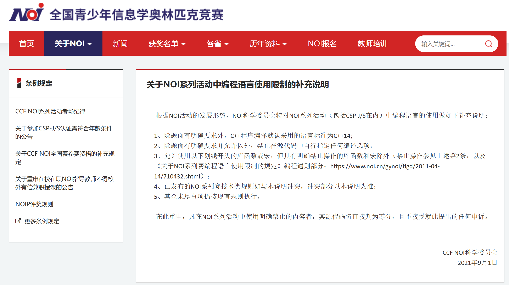
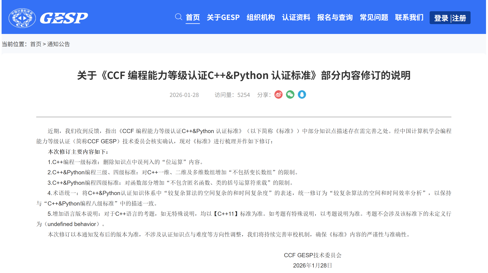

# NOI赛事和GESP认证的编译器版本

> NOI 系列赛事默认 C++14 且禁止选手自行指定编译选项；GESP 默认 C++11 ，且考题不涉及未定义行为。

**官方原文关键信息：**

- NOI系列：“除题面有明确要求外，C++程序编译默认采用的语言标准为C++14；除题面有明确要求并允许以外，禁止在源代码中自行指定任何编译选项。”
- GESP：“对于C++语言的考题，如无特殊说明，均以【C++11】标准为准。如考题有特殊说明，以考题说明为准。考题不会涉及该标准下的未定义行为（undefined behavior）。”

**两份官方文件截图见下方：**

